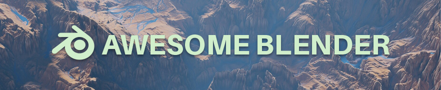

    
    
    

A curated list of awesome <b>Blender</b> add-ons, tools, tutorials and resources for 3D Artists, Hobbyists, Developers, Researchers. Focused <i>mostly</i> open source and free resources. <b>Blender 2.8+</b> compatible list.

<h2>Contents:</h2>
    
| [🔮Add-ons](#Add-ons-) | [🪐Resources](#Resources-) | [📥Standalone](#Standalone-) | [🔍Explore Blender](#Explore-Blender-) | [🖇Social](#Social-) | [👩🏻‍🏫Tutorials](#Tutorials-) | [👩🏽‍💻Development](#Development-) |

<b>Show Detailed Table:</b>

- [🔮Add-ons](#Add-ons-)
    - [🌊Simulation/Physics](#SimulationPhysics-)
    - [🦑Generator/Builder](#GeneratorBuilder-)
    - [🧊Modeling](#Modeling-)
    - [🌠Animation](#Animation-)
    - [🦖Game Engine](#Game-Engine-)
    - [🗜Render Engine](#Render-Engine-)
    - [🔳Texture/UV](#TextureUV-)
    - [🎮GameDev](#GameDev-)
    - [🪀Misc](#Misc-)
    - [🎴Themes](#Themes-)
- [🪐Resources](#Resources-)
    - [🎠3D Models](#3D-Models-)
    - [🤸🏾‍♀️Mocap/Animation](#%EF%B8%8Fmocapanimation-)
    - [🌑Textures](#Textures-)
    - [🌓Blender Materials](#Blender-Materials-)
    - [🌲Blender Scenes/Files](#Blender-ScenesFiles-)
    - [⛅HDRIs](#HDRIs-)
    - [🖼️Art](#%EF%B8%8Fart-)
    - [🛰Space](#Space-)
    - [🎧Sound/Music](#SoundMusic-)
    - [🏞Free Stocks](#Free-Stocks-)
    - [🌂Useful](#Useful-)
- [📥Standalone](#Standalone-)
    - [Blender Builds](#Blender-Builds-)
    - [3D Tools](#3D-Tools-)
    - [Various Tools](#Various-Tools-)
    - [Photogrammetry](#Photogrammetry-)
    - [Texture/Material](#TextureMaterial-)
    - [Terrain](#Terrain-)
    - [Real-World Height Maps](#real-world-height-maps-)
    - [Generator](#Generator-)
    - [AI-Powered](#AI-Powered-)
    - [Sound/Music](#SoundMusic--1)
    - [Painting](#Painting-)
- [🔍Explore Blender](#Explore-Blender-)
    - [Documantation](#Documantation-)
    - [Developement](#Developement-)
    - [Community](#Community-)
- [🖇Social](#Social-)
    - [🔍Explore Artworks](#Explore-Artworks-)
    - [🐦Twitter Accounts](#Twitter-Accounts-)
    - [📢Youtube Channels](#Youtube-Channels-)
    - [💻Blogs](#Blogs-)
    - [🎊Challenges](#Challenges-)
    - [🎉Events](#Events-)
- [👩🏻‍🏫Tutorials](#Tutorials-)
    - [🍩Beginning](#Beginning-)
    - [🗿Modeling](#Modeling--1)
    - [🔘Shader Nodes](#Shader-Nodes-)
    - [🌊Simulation/Physics](#SimulationPhysics--1)
    - [🌠Animation](#Animation--1)
    - [🌌Animation Nodes](#Animation-Nodes-)
    - [🔲UV Mapping](#UV-Mapping-)
    - [🔳Texture Painting](#Texture-Painting-)
    - [📐Compositing](#Compositing-)
    - [🤺Motion Tracking/Capture](#Motion-TrackingCapture-)
    - [Premium Tutorials](#Premium-Tutorials-)
    - [Fundamentals](#Fundamentals-)
    - [📚Books](#Books-)
- [👩🏽‍💻Development](#Development-)
    - [Scripting/Developing](#ScriptingDeveloping-)
    - [Blender Source](#Blender-Source-)
    - [Learn Python](#Learn-Python-)
    - [Learn Computer Graphics](#Learn-Computer-Graphics-)
    - [Related Awesome Lists](#Related-Awesome-Lists-)
- [Symbols](#Symbols-)
- [Contributing](#Contributing-)

 

--------------
<!-- Contributing Guidelines for Add-ons:
-->
## 🔮Add-ons [^](#table)
- Check list of Blender's built-in add-ons documentation [here](https://docs.blender.org/manual/en/dev/addons/index.html).
- Blender addon reviews: 
    - Blogs: [BlenderAddons.org](https://blender-addons.org/), [BlenderNation](https://www.blendernation.com/category/blender/add-ons/).
    - Youtube: [New Media Supply](https://www.youtube.com/channel/UCrRilykeqb6WzYpxaUTzzgg/videos), [Steven Scott](https://www.youtube.com/playlist?list=PLegkgTs-3xf4KkKYDW3jF27lwtSBQQU51), [Markom3D](https://www.youtube.com/playlist?list=PL1DrFRqy1K5XySpq-FFTXqT4JSEg5pEtS).
- Check [List of addons that work with 2.8](https://blenderartists.org/t/list-of-addons-that-work-with-2-8/1132912) on [blenderartists/scripts](https://blenderartists.org/c/coding/released-scripts-and-themes/50).
- Get premium add-ons from [BlenderMarket](https://blendermarket.com/products), [Gumroad](https://gumroad.com/discover?query=blender%20addon).

### 🌊Simulation/Physics [^](#table)
- [FLIP Fluids](https://github.com/rlguy/Blender-FLIP-Fluids) : is a powerful liquid simulation plugin that gives you the ability to create high quality fluid effects all within Blender, the free and open source 3D creation suite. [[market]](https://blendermarket.com/products/flipfluids)
- [Molecular Script](https://github.com/scorpion81/Blender-Molecular-Script) : is a particle collision addon that makes particles collide for creating certain types of simulations, effects and particles linking as well.
- [Jet-Fluids](https://github.com/PavelBlend/blender_jet_fluids_addon) : [Jet fluid](https://github.com/doyubkim/fluid-engine-dev) simulator integration in blender.
- [Mantaflow](http://mantaflow.com/) : is an open-source framework targeted at fluid simulation research in Computer Graphics. *Now it is  [part](https://wiki.blender.org/wiki/Reference/Release_Notes/2.82/Physics) of the blender since 2.82 release!* [![][repo]](https://github.com/sebbas/BlenderMantaflow)
- [projectile](https://gumroad.com/l/projectile) : An artist-friendly tool for throwing stuff around inside blender. [![][repo]](https://github.com/natecraddock/projectile)
- [Phobos](https://github.com/dfki-ric/phobos) : Phobos is an add-on for the open-source 3D modeling software Blender that enables the creation of WYSIWYG robot models for use in robot frameworks like ROS and ROCK or in real-time simulations such as MARS or Gazebo.
- [FishSim](https://github.com/nerk987/FishSim) : Fish Swimming Simulator. This addon aims to make it easier to animate natural movements of fish by allowing the animation of targets or proxies, and then simulating the movements required for the fish to follow these targets.
- [CubeSurfer](https://github.com/porkminer/CubeSurfer) : IsoSurface mesher addons for Blender.

### 🦑Generator/Builder [^](#table)
- 👤[FaceBuilder](https://www.keentools.io/download/facebuilder-for-blender) : is a Blender add-on that lets you create photorealistic 3D models of human faces and heads using a few photographs with a neutral face expression. [[medium]](https://medium.com/keentools/facebuilder-for-blender-guide-cbb10c717f7c)
- 🚶🏻‍♀️[MB-Lab](https://mblab.dev/) : is a free, open source character creation tool for Blender. [![][repo]](https://github.com/animate1978/MB-Lab)
- [The Grove 3D](https://www.thegrove3d.com/) [$] : Grow natural 3D trees for visualisation and film. Grow, bend, prune, interactively simulate the seasons year by year.
- [tree-gen](https://github.com/friggog/tree-gen) : procedural generation of tree models in blender.
- [Modular Tree](https://github.com/MaximeHerpin/modular_tree/tree/blender_28) : This addon for blender allows the creation of realistic trees with the node editor.
- [Bricker](https://github.com/bblanimation/bricker) : Photoreal Lego/Minecraft Simulations. [[market]](https://www.blendermarket.com/products/bricker)
- [SpaceshipGenerator](https://github.com/a1studmuffin/SpaceshipGenerator) : procedurally generate 3D spaceships.
- [Space Station Generator](https://gumroad.com/curtisjamesholt#iABmB) : Tool lets you generate sprawling space stations.
- [Building Tool](https://github.com/ranjian0/building_tool)   : Building generation addon for blender.
- [Procedural Cloudscape Generation](https://blenderartists.org/t/procedural-cloudscape-generation-in-cycles-now-eevee/694700/12)  : Create pretty realistic looking cloudscapes in Cycles and Eevee.
- [Real Snow](https://3d-wolf.com/products/snow.html) : is an addon to create snow on top of objects. [![][repo]](https://github.com/macio97/Real-Snow)
- [Welder](https://blenderartists.org/t/welder/672478) : welds generator for Blender.
- [Sprytile](https://github.com/ologon/Sprytile) : a blender add-on for building tile based low-poly scenes with paint/map editor like tools. [[more info]](https://itch.io/post/1034106)
- [Scatter](https://blendermarket.com/products/scatter) [$] : The scattering tool for blender.
- [SceneCity](https://www.cgchan.com/store/scenecity) [$] : Generate large road networks and mass-place tens of thousands of buildings. Mix both procedural and hand-made assets.
- [Graswald](https://www.graswald3d.com/) [$] : is the solution for 3D Artists who need realistic vegetation in their scenes.
- [Celtic Knot](https://github.com/BorisTheBrave/celtic-knot/wiki/Gallery) : Generate bezier curves, pipes and ribbons in elaborate weavings, based off of a framework mesh.
- [Floorboard Generator](https://blenderartists.org/t/a-floor-board-generator/582368/195) : Generate floor board. [![][repo]](https://github.com/importbpy/Floorboard-Generator)
- [Piperator](https://blenderartists.org/t/blender-addon-piperator-generation-of-pipe-networks-new-version-with-vertex-color-pipe-control/1186693) : is an addon for blender which helps generating complex pipe layouts.
- [Mesh Maze](https://github.com/elfnor/mesh_maze) : Blender add-on to generate a maze on any mesh.
- [BookGen](https://oweissbarth.de/software/book-gen-blender-addon/) : is a free book-generation addon for Blender.
- [City Scatter](https://gumroad.com/curtisjamesholt#Illil) : Generate cityscape concepts, powered by Blender's collection system.
- [TubeTool](https://github.com/zeffii/TubeTool) : Generate tubing between two selected polygons.
- [Blender Data Visualisation](https://github.com/Griperis/BlenderDataVis) : Load data into Blender and create visualisations.

### 🧊Modeling [^](#table)
- [Sorcar](https://aachman98.itch.io/sorcar) : Procedural modeling in Blender using Node Editor. [![][repo]](https://github.com/aachman98/Sorcar)
- [Sverchok](http://nikitron.cc.ua/sverchok_en.html) : is a powerful parametric tool for architects, allowing geometry to be programmed visually with nodes. [(sverchok-extra)](https://github.com/portnov/sverchok-extra) [![][repo]](https://github.com/nortikin/sverchok)
- [MACHIN3tools](https://gumroad.com/l/MACHIN3tools) : is a free, continuously evolving collection of blender tools and pie menus in a single customizable package. [![][repo]](https://github.com/machin3io/MACHIN3tools) [[market]](https://blendermarket.com/products/MACHIN3tools)
- [QBlocker](https://qblockerdocs.readthedocs.io/) :  is an interactive object creation tool for Blender.
- [fspy](https://fspy.io/) : is an open-source camera matching app, extremely useful for modeling directly from a reference image. [(blender addon)](https://github.com/stuffmatic/fSpy-Blender)
- [PolyQuilt](https://github.com/sakana3/PolyQuilt) : is provides a few functions in edit mode like creating faces, knife tool, fan, edge-loops, etc. It does this with only the left-mouse-button. So no menu’s, no shortcuts. [[more info]](https://www.youtube.com/watch?v=VKLPHh3CYCU)
- [Modeling Cloth](https://github.com/the3dadvantage/Modeling-Cloth-2_8) : Create real-time cloth-like behavior in meshes in Blender.
- [KeKit](https://artbykjell.com/blender.html) : Brings some much needed functionality to Blender, with a whole array of production tools.
- [Array Tools](https://blenderartists.org/t/array-tools-all-in-one-for-translation-scale-and-rotation-array/1170295?u=peetie) : is an addon for Blender to create translation, scale, rotation array with offset or global parameters in any direction and mix them. [![][repo]](https://github.com/Elreenys/array_tools)
- [BezierUtility](https://github.com/Shriinivas/blenderbezierutils) : This add-on contains several tools for working with Bezier curves.
- [Mesh Heal](https://blenderartists.org/t/mesh-heal/1117095) : is an add-on for Blender, it includes additional Blender operators for healing surface meshes.
- [JewelCraft](https://github.com/mrachinskiy/jewelcraft) : jewelry design toolkit add-on for Blender.
- [Box Select X-Ray](https://blenderartists.org/t/box-select-x-ray/1212316) : Modified box select tool that automatically toggles x-ray mode on and off during selection.
- [Polysweeper](https://blenderartists.org/t/polysweeper-0-81/1147066) : is a tool to sweep a face profile along a face loop.
- [Edit Split Normals](https://twitter.com/Oscurart/status/1243226933464268802) : Edit normals like meshes.
- [Auto Mirror](https://blenderartists.org/t/auto-mirror-blender2-8-ver/1151539) : Automate a series of tasks, such as deleting a half, setting a mirror modifier, setting a clipping, etc.
- Retopology/Remesh:
    - [retopoflow](https://blendermarket.com/products/retopoflow)  : A suite of retopology tools for Blender. [![][repo]](https://github.com/CGCookie/retopoflow)
    - [InstantMeshesRemesh](https://blenderartists.org/t/instant-meshes-remesh/1114982)  : A suite of retopology tools for Blender. [![][repo]](https://github.com/knekke/blender_addons#instantmeshesremesh)
    - [SpeedRetopo](https://gumroad.com/l/speedretopo)  : is a free add-on for Blender to make fast and easy retopology using Bsurface.
    - [Retopo MT](https://gumroad.com/l/cNGNb)  : is a tool for retopo, you use it in addition with other addons or tools in Blender, in Edit Mode.
- Hard Surface:
    - [KIT OPS](https://gumroad.com/l/kitops) : Can create objects and scenes with extreme efficiency and speed. Complex industrial designs can be generated in a single sitting.
    - [HardOps/Boxcutter](https://blendermarket.com/products/hard-ops--boxcutter-ultimate-bundle) [$] : [HardOps](https://blendermarket.com/products/hardopsofficial), is intended to be a workflow assistant toolkit. [Boxcutter](https://blendermarket.com/products/boxcutter), the most powerful boolean subsystem for blender.
    - [Speedflow](https://gumroad.com/l/speedflow) [$] : Addon for non-destructive workflow.
    - [Bevel After Boolean](https://blenderartists.org/t/wip-bevel-after-boolean/693072?u=peetie) : Addon comes in handy when working with booleans that have a curved surface. 
    - [EdgeFlow](https://github.com/BenjaminSauder/EdgeFlow/tree/blender_28) : This addon adds two operators to blender which both work on edgeloop selections.
    - [Engraver](https://gumroad.com/l/qOyVO) : is an Blender addon with set of few tools designed to help carving decals in 3d models.
    - [Fast Carve](https://github.com/jayanam/fast-carve/tree/fast-carve-2-8) : Hardsurface utility Blender addon for fast boolean and bevel operations.
    - [Offset Edges](https://blenderartists.org/t/offset-edges/584283/259) : this addon introduces a cad-like feature, which create edges that have consistent distance from original selected ones.
    - [Mesh Utils](https://github.com/rpopovici/mesh-utils) : Overlapping vert/edge/face, interior faces, edges by trait, and other stuff.
    - [Poly Source](https://gumroad.com/l/polysource) : is designed to simplify the control of the number of different types of polygons. You can see how many Gone, Quad and Tris are on the active object.
- Sculpt:
    - [Blender-Sculpt-Tools](https://github.com/anfeo/Blender-Sculpt-Tools) : Addon for help sculpting base mesh like Zbrush with Zsphere.
    - [Sculpt Alphas Manager](https://blenderartists.org/t/sculpt-alphas-manager/1200725) : This addon provides a simple solution to be able to quickly switch alpha textures for the sculpt brushes.
    - [Speedsculpt](https://gumroad.com/l/SpeedSculpt) [$] : The addon allows you to create very fast characters, to manage Dyntopo Sculpting with booleans, cut curves, skin modifier, decimate, mask etc.
    - [GoB](https://github.com/JoseConseco/GoB) : GoZ-alike tools for simple ZBrush-Blender interchange.
- Snapping-Align:
    - [Mesh Align Plus](https://github.com/egtwobits/mesh_mesh_align_plus) : Precisely align, move, and measure+match objects and mesh parts in your 3D scenes.
    - [Easy Align](https://blenderartists.org/t/addon-easy-align/685704) : Easy Align addon allows you to align mesh objects origins and align mesh objects to each others easily, it works in both Edit mode and Object mode. [![][repo]](https://github.com/sergeod9/Easy_Align_Addon)
- Mesh Generate/Stylization:
    - [Tissue](https://github.com/alessandro-zomparelli/tissue) : Add-on for computational design.
    - [Mech/Fy](https://gumroad.com/l/KZllV) A procedural workflow that automates the process of hard surfaces modelling.
    - [RandoMesh](https://github.com/mantissa-/RandoMesh) : A blender addon to add randomized geometry to any mesh.
    - [SliceMesh](https://github.com/mantissa-/SliceMesh) : Simple script for Blender 2.80 to automate mesh slicing.
    - [SuperPoke](https://github.com/mantissa-/SuperPoke) : Iterative poking tool for Blender.
    - [MegaGrid](https://github.com/mantissa-/MegaGrid) : Simple Python script to randomly spam subdivisions.
    - [BY-GEN](https://gumroad.com/l/BY-GEN) : is an addon designed to simplify the process of creating non-destructive, generative modeling styles in Blender. [![][repo]](https://github.com/curtisjamesholt/BY-GEN-public)
    - [Fiber Mesh](https://blenderartists.org/t/fiber-mesh-resurrected-for-2-80/1141872) : Generate fiber meshes.
    - [Laser Slicer](https://github.com/rgsouthall/laser_slicer) : Cuts up a Blender object and exports the slices to SVG files for cutting on a laser cutter or other post-processing.

### 🌠Animation [^](#table)
- [Animation Nodes](https://animation-nodes.com/) : A node based visual scripting system designed for motion graphics in Blender. [![][repo]](https://github.com/JacquesLucke/animation_nodes)
- [Commotion](https://github.com/mrachinskiy/commotion) : Blender add-on for motion graphics.
- [Animax](https://blendermarket.com/products/animax---procedural-animation-system-) [$] : is a procedural animation system for Blender. Useful for animating multiple objects.
- [AutoMask](https://github.com/lukas-blecher/AutoMask) : A Blender Add-on for automatic rotoscoping with the help of Machine Learning.
- [COA Tools](https://github.com/ndee85/coa_tools) : is a 2D Animation Suite for blender. It offers a 2D cutout animation workflow similar to programs like spine or spriter.
- [reflow](https://gitlab.com/diegogangl/reflow) : Blender addon to change fps.
- [Keyframe Nudge](https://github.com/okuma10/Keyframe-Nudge) : Scripts for quick keyframe maniplation.
- [Real-Time-Animation](https://github.com/SavMartin/Real-Time-Animation-Addon-Update-to-2.80) : Addon for animating by recording object motion This addon for Blender lets you move objects of any type (including cameras, lights, etc) and bones in 3D space and record their motion as keyframes.
- Writing/Counting: 
    - [WritingAnimation](https://github.com/Shriinivas/writinganimation), [Typewriter](https://github.com/doakey3/blender-typewriter-addon), [TextCounter](https://github.com/leomoon-studios/leomoon-textcounter/), [GreaseWriter](https://github.com/doakey3/GreaseWriter).
- Rigging:
    - [JiggleArmature](https://cheece.github.io/JiggleArmature/) : is an easy way to create wiggle effects in blender, just enable jiggle bone on the bones you want to be jiggly. [![][repo]](https://github.com/cheece/JiggleArmature)
    - [Rigacar](https://github.com/digicreatures/rigacar) : Generate rig for cars.
    - [RigFlex](https://github.com/nerk987/RigFlex) : Simple soft body for Blender armatures.
    - [Rigid Bodys Generator](https://github.com/12funkeys/rigid_bodys_gen) : Blender addon to add Rigid bones and Joints on selected bones easily.

### 🦖Game Engine [^](#table)
-  [Armory](https://armory3d.org/) : is an open-source 3D game engine with full Blender integration. [![][repo]](https://github.com/armory3d/armory)
- [UPBGE](https://upbge.org/) : is an open-source 3D game engine forked from old Blender Game Engine, deployed with Blender itself. [![][repo]](https://github.com/UPBGE/upbge)
-  [Arsenal](https://katharostech.github.io/arsenal) : is a Blender integrated game engine written in Rust. [![][repo]](https://github.com/katharostech/arsenal)

### 🗜Render Engine [^](#table)
- [appleseed](https://appleseedhq.net/) : is an open source, physically-based global illumination rendering engine primarily designed for animation and visual effects. [![][repo]](https://github.com/appleseedhq/appleseed) [(blender addon)](https://github.com/appleseedhq/blenderseed)
- [LuxCore](https://luxcorerender.org/) : LuxCoreRender is a physically based and unbiased rendering engine. It offers advanced features like accelerated rendering of indirect light and efficient rendering of caustics. [![][repo]](https://github.com/LuxCoreRender/BlendLuxCore) [(blender addon)](https://github.com/LuxCoreRender/BlendLuxCore)
- [E-Cycles](https://blendermarket.com/products/e-cycles) [$] : is a fork of Cycles which renders up to 2.5x faster out of the box when using CUDA GPUs, up to 15x using new options.
- [AMD Radeon ProRender](https://www.amd.com/en/technologies/radeon-prorender-blender) : is AMD’s powerful physically-based rendering engine that lets creative professionals use open industry standards to leverage GPU and CPU performance to produce stunningly photorealistic images in Blender.
- [Pixar's RenderMan for Blender](https://github.com/tyler-furby/RenderManForBlender) : Physically-based render from Pixar. Not officially supported 2.8 there are bunch of plugins made by blender community. [[more info]](https://blenderartists.org/t/pixar-renderman-for-blender/646404/650)
- [Blender Octane Render](https://render.otoy.com/forum/viewtopic.php?f=7&t=72241) : Fully integrated Octane Render, free tier.
    - [🧾OctaneRender for Blender Plugin Manual.](https://docs.otoy.com/BlenderH/BlenderPluginManual.htm)
    - [OTOY Forums/Blender](https://render.otoy.com/forum/viewforum.php?f=32).
    - [Quixel Megascans Plugin for Octane Edition](https://github.com/Yichen-Dou/MSLiveLink-OC-Blender).
- *[Redshift Blender Plugin Alpha](https://trello.com/c/umeZ5JvZ/4-blender-plugin-alpha) : Redshift Trello page has been updated with a new Blender IPR Preview video. _The Plug-in is currently under development._ [(video)](https://www.youtube.com/watch?v=udv1uILubzM)

### 🔳Texture/UV [^](#table)
- [Poliigon Uber Mapping Node](https://www.dropbox.com/s/b8p5nmg7evqbsd6/PoliigonUberMapping_v1.0.blend) : Anti-tile node setup for blender. [[more info]](https://youtu.be/CQ9VmCN2EsE?t=456)
- [Parallax Mapping](https://gumroad.com/neveselov#WhPLq) : This is Parallax Mapping material and node setup. Created in Blender 2.8 for eevee renderer, it works well in cycles too. [[more info]](https://www.youtube.com/watch?v=ZL695WnJvmU)
- [Texel Density Checker](https://gumroad.com/l/CEIOR) : Tools for calculate, set and copy texel density. [![][repo]](https://github.com/mrven/Blender-Texel-Density-Checker) [[market]](https://blendermarket.com/products/texel-density-checker)
- [UV Toolkit](https://gumroad.com/alexbel#NbMya) : Tools collection for UV editing in blender.
- [TexTools](http://renderhjs.net/textools/blender/) : TexTools is a Free addon for Blender 3D with a set of professional UV and Texturing tools. [![][repo]](https://github.com/SavMartin/TexTools-Blender)
- [Magic-UV](https://nutti.github.io/Magic-UV/) : This is a blender add-on Magic UV consisted of many UV manipulation features which Blender lack of. [![][repo]](https://github.com/nutti/Magic-UV)
- [EasyBake](https://github.com/leukbaars/EasyBake) : Texture baking UI for Blender that lives in the 3D Viewport. Small but powerful! Fast one-click baking and iteration.
- [Principled-Baker](https://github.com/danielenger/Principled-Baker) : Bake PBR textures with a few clicks.
- [Blender Addon PBR](https://github.com/DigiKrafting/blender_addon_pbr) : Provides a material panel that creates Metallic/Roughness or Specular/Gloss Nodes using the Principled BSDF shader.
- [PBR Texture Mapper](https://github.com/jayanam/pbr_texture_mapper) : Create PBR node setup with one click.
- [Poliigon Material Converter](https://help.poliigon.com/en/articles/2540839-poliigon-material-converter-addon-for-blender) : Create PBR node setup.
- [SCATTr](https://gumroad.com/l/scattr) : Procedural texture placement.
- [Vertex Oven](https://github.com/ForestKatsch/VertexOven)  : Bake game-ready ambient occlusion in seconds without UV unwrapping or agonizingly slow Cycles bakes. [[market]](https://blendermarket.com/products/vertex-oven)
- [Bake Wrangler](https://blenderartists.org/t/bake-wrangler-node-based-baking-tool-set-ver-b0-9-4-curvycavity/1187732) : is a nodes based extension and replacement for the inbuilt baking system.
- [3D-Coat Applink](https://www.youtube.com/watch?v=2bo2XGUPwIU) : 3DCoat now has native support of Blender via built-in AppLink.
- [Lily Surface Scrapper](https://github.com/eliemichel/LilySurfaceScrapper) : Import shaders in Blender from a single URL.

### 🎮GameDev [^](#table)
- [MeshSync](https://github.com/unity3d-jp/MeshSync) : Live link plugin for Unity. supported blender and other 3d softwares.
- [Mr Mannequins Tools](https://forums.unrealengine.com/community/community-content-tools-and-tutorials/1661319-easily-export-import-animations-and-meshes-blender-to-ue4-free-addon-mr-mannequins-tools-v1-2) : is a Blender add-on  that gives the ability to export animations and weighted meshes that are directly compatible with the third person mannequin without re-targeting anything in Unreal Engine! [![][repo]](https://github.com/Jim-Kroovy/Mr-Mannequins-Tools)
- [Blender For Unreal Engine](https://blenderartists.org/t/assetgen-create-a-game-asset-in-a-single-click/702849) : This Add-on allows you to export content created with Blender to Unreal Engine 4.
- *[Send to Unreal](https://www.youtube.com/watch?v=c3_xUMQ6hhs) : Official Unreal add-on for Blender. _The Add-on is currently under development._
- [AssetGen](https://github.com/xavier150/Blender-For-UnrealEngine-Addons) : is automates the tasks to get a game assets ready for video games from an High Poly model.
- [V-HACD](https://blenderartists.org/t/v-hacd-tool-for-creating-accurate-convex-collision-meshes-for-real-time-physics-in-games-etc/1156822) : Library decomposes a 3D surface into a set of near convex parts. [![][repo]](https://github.com/andyp123/blender_vhacd)
- [Godot Game Tools](https://viniguerrero.itch.io/godot-game-tools) : Made easy importing mixamo animations. tools to ease the creation/import process of assets into Godot Game Engine and others.
- [Embark Blender Tools](https://github.com/EmbarkStudios/blender-tools)  : A Blender add-on containing workflow tools for game development. Includes tools for standardized import/export workflow, 3D modelling and new object types. [[medium]](https://medium.com/embarkstudios/a-love-letter-to-blender-e54167c22193)

### 🪀Misc [^](#table)
- Management:
    - [BlenderKit](https://www.blenderkit.com/) : Allows you to download assets, materials, and alpha brushes to your blender 2.8 client with the click of a button for free. _Now you can find it on built-in addons._
    - [Blender Interplanety Storage](https://blenderartists.org/t/bis-online-material-storage/689728) : The online material (shader) storage add-on for Blender 3D creation. With the BIS add-on, you can save materials (groups of nodes) to the online personal library and then convenient search and upload them.
    - [Asset Wizard](https://blenderartists.org/t/asset-wizard-for-blender-2-8/1149311) : is a asset management addon.
    - [NodeCustomBuilder](https://blenderartists.org/t/nodecustombuilder-2-8-free-addon/1152185) : Preset system for nodes.
    - [FontSelector](https://github.com/samytichadou/FontSelector_blender_addon/) : Easy font management inside Blender.
- Lighting/HDRI
    - [Gaffer](https://github.com/gregzaal/Gaffer) : is a Blender add-on that helps you light your scenes by presenting all the right settings in convenient panels for quick access and experimentation. [[market]](https://blendermarket.com/products/gaffer-light-manager/)
    - [Extra Lights](https://github.com/jlampel/bl_extra_lights) :  is a plugin for Blender that adds physically based, photometric lighting presets to the Add menu. [[market]](https://blendermarket.com/products/extra-lights)
    - [HDRI Sun Aligner](https://github.com/akej74/hdri-sun-aligner) : HDRI Sun Aligner is a Blender 2.8 addon for automatically rotating an object (e.g. a sun) to match the brightest point in a HDRI environment texture.
    - [LeoMoon LightStudio](https://leomoon.com/downloads/plugins/leomoon-lightstudio/) : Lighting system for Blender. [[market]](https://blendermarket.com/products/leomoon-lightstudio)
    - [Physical Starlight and Atmosphere](https://blendermarket.com/products/physical-starlight-and-atmosphere) [$] : is a full environmental simulator that takes inspiration of 'sandbox' game worlds and editors, bringing visual consistency between every object in the scene.
- Geographic/Maps:
    - [BlenderGIS](https://github.com/domlysz/BlenderGIS) : Blender addons to make the bridge between Blender and geographic data.
    - [Maps Models Importer](https://github.com/eliemichel/MapsModelsImporter) : A Blender add-on to import models from *Google Maps*. [[more info]](https://blog.exppad.com/article/importing-actual-3d-models-from-google-maps)
    - [blender-osm](https://gumroad.com/l/blender-osm) : One click download and import of OpenStreetMap and terrain for Blender.
- VR/AR 
    - [blender-xr](https://www.marui-plugin.com/blender-xr/) : A free virtual and mixed reality user interface for Blender that enables artists to edit scenes within the software using a suitable headset and controllers.
    - [Blender-Metaverse-Addon](https://github.com/Menithal/Blender-Metaverse-Addon) : Blender toolset for creating content for Metaverses like High Fidelity.
- ArcViz
    - [JARCH-Vis](https://blenderartists.org/t/addon-jarch-vis/642607) : is add-on for Blender 3D that helps create commonly used object for architectural visualization. [![][repo]](https://github.com/BlendingJake/JARCH-Vis)
    - [Archipack](https://gumroad.com/l/ZRMyP) [$] : The Archipack addon for Blender contains a collection of parametric primitives for ArchViz. You can manipulate these primitives with a realtime on-screen editing interface. [![][repo]](https://github.com/s-leger/archipack)
- Import:
    - [Daz Importer](https://bitbucket.org/Diffeomorphic/import-daz/src/master/), [glTF](https://github.com/KhronosGroup/glTF-Blender-IO/tree/blender-v2.82-release), [Rhinoceros3D files](https://blenderartists.org/t/import-rhinoceros-3d-files-into-blender/1136070), [.SVG](https://github.com/Shriinivas/shapekeyimport), [.XPS](https://github.com/johnzero7/XNALaraMesh), [.GIF](https://github.com/doakey3/Bligify), Quake: [.BSP](https://blenderartists.org/t/quake-1996-game-bsp-import-script/578191) [.MD3](https://github.com/axredneck/blender-md3/tree/blender2.8).
    - [Sketchfab Blender Addon](https://github.com/sketchfab/blender-plugin) : Directly import and export models from and to Sketchfab in Blender.
- Export:
    - [USDZ](https://github.com/robmcrosby/BlenderUSDZ), [glTF MultiExport](https://github.com/MozillaReality/blender-gltf-multiexport-addon), [ZBrush](https://blenderartists.org/t/goz-for-blender-2-8/1138418), [.VTK](https://github.com/tkeskita/io_mesh_vtk), [Bezier2SVG](https://leomoon.com/downloads/plugins/leomoon-bezier2svg/), [Panda3D](https://github.com/Moguri/blend2bam), [.EGG](https://github.com/kergalym/YABEE), [XRay-engine](https://github.com/PavelBlend/blender-xray).
    - [Export Paper Model from Blender](https://addam.github.io/Export-Paper-Model-from-Blender/) : Add-on for creating paper models. [![][repo]](https://github.com/addam/Export-Paper-Model-from-Blender)
- Render:
    - [BatchRender](https://github.com/VertStretch/RenderBurst), [Notify](https://github.com/Dziban-dev/Notify_Blender_Render), [AlarmShutdown](https://gumroad.com/l/PcDfw), [RenderButton](https://github.com/Mitsuma/Blender2.8-RenderButton).
    - [Eevee Presets](https://github.com/danielenger/Eevee-Presets) : Save Eevee Presets.
- Camera:
    - [Real Camera](https://3d-wolf.com/products/camera.html) : is an addon that allows you to control the Blender camera like a real camera. [![][repo]](https://github.com/macio97/Real-Camera)
    - [Cameras-Lister](https://github.com/Ryxx/Cameras-Lister) : Easy select camera’s in popup shortcut is Alt-C.
    - [Photographer](https://blenderartists.org/t/photographer-camera-exposure-white-balance-and-autofocus/1101721/238) : Camera Exposure, White balance and Autofocus.
- Audio Visualizer
    - [Bizualizer](https://github.com/doakey3/Bizualizer), [Curtis Holt's](https://gumroad.com/l/klmfi).
- Display:
    - [Screencast-Keys](https://github.com/nutti/Screencast-Keys) : Status Add-On for Blender.
    - [Shortcut VUr](https://github.com/jayanam/shortcut_VUr) : With this addon you can display mouse and keyboard input.
    - [ExtraInfo](https://gumroad.com/l/UznDL) : Show more info in the viewport.
    - [AStats](https://github.com/YuriyAndropov/blenderPython/tree/master/AStats) : Show Stats in Viewport.
- VideoEditor:
    - [Power Sequencer](https://github.com/GDQuest/blender-power-sequencer) : Brings smart new editing features to edit faster with Blender's Video Sequence Editor. It is completely Free and Open Source.
    - [VSEQF](https://github.com/snuq/VSEQF) : is an overhaul for Blender's VSE that can completely change your workflow. Designed for quick, mouse and keyboard balanced editing with a focus on real-time feedback.
    - [Freesound Add-on](https://github.com/iwkse/freesound/tree/freesound-2.0) : is an addon for Blender that allows users to create and edit subtitles for movies or music. 
    - [Subsimport](https://github.com/doakey3/Subsimport) : is an addon for Blender that allows users to create and edit subtitles for movies or music.
- Photogrammetry:
    - [Photogrammetry Importer](https://github.com/SBCV/Blender-Addon-Photogrammetry-Importer)  : Addon to import different photogrammetry formats into Blender.
    - [blender_kitti](https://github.com/risteon/blender_kitti)  : Render large point clouds and voxel grids with blender.
    - [Point Cloud Visualizer](https://github.com/uhlik/bpy#point-cloud-visualizer-for-blender-280) : Display, edit, filter, render, convert, generate and export colored point cloud PLY files.
- AddonCollections: [varkenvarken/blenderaddons](https://github.com/varkenvarken/blenderaddons), [uhlik/bpy](https://github.com/uhlik/bpy), [YuriyAndropov/blenderPython](https://github.com/YuriyAndropov/blenderPython), [bookyakuno/-Blender-](https://github.com/bookyakuno/-Blender-), [Stromberg90/Scripts](https://github.com/Stromberg90/Scripts/tree/master/Blender), [ethanaeris](https://gist.github.com/ethanaeris/), [oscurart](https://github.com/oscurart/Blender-28-Addons).
- [Projectors](https://github.com/Ocupe/Projectors) : A blender add-on for simple projector creation and modification.
- [Shape Keys+](https://blenderartists.org/t/shape-keys/680636) : adds a panel with extra options for creating, sorting, viewing, and driving shape keys.
- [Simple Renaming Panel](https://github.com/Weisl/simple_renaming_panel) : Rename more objects at once. The tool includes basic functionalities of adding suffixes, prefixes, search and replace, add suffixes depending on the object type and much more.
- [IOR_reference](https://github.com/diegogangl/IOR_reference) : A blender addon that display IOR values in a list.
- [QuickSwitch](https://github.com/schroef/QuickSwitch) : A helper to quick switch workspaces and view render menu in viewport.
- [MifthTools](https://github.com/mifth/mifthtools) : 3Dcoat, Houdini, Modo mesh exchange tools and more.
- [Modifier List](https://blenderartists.org/t/modifier-list-1-5-1/1147752) : Alternative UI layout for modifiers with handy features. Available also inside the sidebar and as a popup.
- [Verge3D](https://www.soft8soft.com/get-verge3d/) : is a powerful yet cost-efficient solution for creating interactive 3D web experiences.
- [CubeSter](https://github.com/BlendingJake/CubeSter) : is an add-on for Blender 3D that takes an image or audio file and converts it into a height-based mesh object.
- [ProSidebar](https://github.com/CreativeDesigner3D/ProSidebar) : Add additional properties and operators to the 3D View Sidebar.
- [Tilecam](https://github.com/stuffmatic/tilecam) : Render seamlessly repeatable images.
- [Fbx Format Converter](https://github.com/BobbyAnguelov/FbxFormatConverter) : This project allows you to convert binary fbx files to asciis and vice versa.
- [Set Viewport Color](https://github.com/eliemichel/LilySurfaceScrapper) : Blender Script to Set the Viewport Color based on a nodetree.
- [PresetterProfessional](https://github.com/dpdpforlife/PresetterProfessional) : View and visibility presets, 3d cursor presets, snap presets, etc. presets.
- [PowerSave](https://gumroad.com/l/powersave) : is a tool intended to streamline saving and make saving itself more accessible, friendly and more artist streamlined.
- [Lodify](https://devtalk.blender.org/t/level-of-detail-addon/12840) : LOD(Level of Detail) and Proxy system for blender. [![][repo]](https://github.com/DB3D/Lodify)

### 🎴Themes [^](#table)
- [Blender Pro](https://github.com/paulcoops/blender_pro-theme), [Curt's](https://gumroad.com/l/fWkBi), [80's](https://gumroad.com/l/fWkBi), [Awesome](https://blenderartists.org/t/awesome-theme-for-blender-2-8/1120656), [Nord](https://devtalk.blender.org/t/call-for-content-themes/3174/382).
    - [Call for Content: Themes](https://devtalk.blender.org/t/call-for-content-themes/3174)
    - [Theme Development - Paper Cuts](https://devtalk.blender.org/t/theme-development-paper-cuts/9715)
    - [Blender UI Paper Cuts](https://devtalk.blender.org/t/blender-ui-paper-cuts/2596)
- [Theme Switcher](https://blenderartists.org/t/theme-switcher/1211787) : Addon to quickly change active theme not leaving 3D View.

--------------
<!-- Contributing Guidelines for Resources:
-->
## 🪐Resources [^](#table)

### 🎠3D Models [^](#table)
- [Quixel Megascans](https://quixel.com/megascans/library/) : World’s largest photogrammetry 2D and 3D asset library. Now it is free for the Epic Games accounts.
- [Scan the World](https://www.myminifactory.com/scantheworld/) : is an ambitious community-built initiative whose mission is to share 3D printable sculpture and cultural artefacts using democratised 3D scanning technologies, producing an extensive ecosystem of free to download digital cultural heritage.
- [Artec 3D](https://www.artec3d.com/3d-models) : Download high resolution 3D scans for free.
- [3DModelHaven](https://3dmodelhaven.com/models/) : is a resource of free high quality 3D assets for everyone, following in the footsteps of HDRI Haven and Texture Haven. All models here are CC0.
- [Blender Boom](https://www.blenderboom.com/product-category/free/) : 3D model repository. Free models ready to use.
- [Archive 3D](https://archive3d.net/) : Download Free 3D Objects.
- [Free3D](https://free3d.com/) : is the go to place where you can share your free 3D assets and download instantly any you like.
- [3DB3](https://3db3.com/) : Check out the best 3D models made by professional 3D artists.
- [Rigmodels](http://rigmodels.com/) : Free rigged, animated and low poly models
- [RockThe3D](http://www.rockthe3d.com/) : is a blog site to provide and sharing the best 3D related knowledge and resources around.
- [CGTrader](https://www.cgtrader.com/free-3d-models) : Free 3D models from cgtrader.
- [Sketchfab](https://sketchfab.com/search?features=downloadable&sort_by=-pertinence&type=models) : Free downloadable models from sketchfab.
- [TurboSquid](https://www.turbosquid.com/Search/3D-Models/free) : Free models from turbosquid
- [Clara.io](https://clara.io/library) : Free 3D Modeling, Rendering, Sharing and Models.
- [3D Warehouse](https://3dwarehouse.sketchup.com/search/) : Download sketchup models.
- [KitBash3d](https://kitbash3d.com/) [$] : makes premium 3D assets for VFX, concept art and design. Their 3D model kits have immediately been adopted by the industry's top artists, studios. *Get [Mini-Kit: Post-Apocalypse](https://kitbash3d.com/collections/kits/products/mini-kit-post-apocalypse)* for free. *Get [Utopia Kit](https://kitbash3d.com/blogs/news/free-utopia-kit-for-brightartdarktimes)* for free. 
- [Awesome-3D-Meshes](https://github.com/jvm-graphics-labs/awesome-3d-meshes/) : List of famous 3D meshes.
- Others:
    - [Google Poly](https://poly.google.com/blocks), [GrabCAD](https://grabcad.com/library), [Xfree3D](https://vwartclub.com/?section=xfree3d), [Gumroad/free-3d-model](https://gumroad.com/discover?maxPrice=0&query=3d%20model), [Artstation Marketplace/free](https://www.artstation.com/marketplace?sort_by=trending&filter_by=free), [Quaternius's Ultimate Low-Poly Models](http://quaternius.com/index.html), [Cubebrush/freebies](https://cubebrush.co/marketplace?freebies=true), [Daz3D/freebies](https://www.daz3d.com/free-3d-models), [The Art of 3D Insects](https://stock.adobe.com/collections/rTMsIExGHtyXsAv8NL8RfOxokqALHQhy).
- Kitbash Models:
    - [Free Hard Surface KitBash Models](https://gumroad.com/olegushenok?sort=page_layout&tags=free), [Free sci-fi kitbash set](https://cubebrush.co/polyworkshop/products/audboa/free-sci-fi-kitbash-set-fusion-360-zbrush), [Hard Surface Kitbash Pack](https://gumroad.com/averkin), [3D Kitbashing library](https://gumroad.com/adrianrutkowski), [Kitbash Sci-fi Buildings](https://www.artstation.com/art-mage/store/Vb1A/kitbash-sci-fi-buildings-vol-1-5).
- Cloth Models:
    - [10 Free Marvelous Designer Pack](https://twitter.com/smeccea/status/1229489865114320896).
- VDB Models:
    - [Free VDB Simulations Created With Embergen](https://jangafx.com/software/embergen/download/free-vdb-animations/), [OpenVDB Sample Models](https://www.openvdb.org/download/), [disneyanimation.com/clouds](https://www.technology.disneyanimation.com/clouds), [Free Volume Cloud and Smoke](https://gumroad.com/l/PCJDF), [200 Modular OpenVDB Clouds](https://cubebrush.co/byvfx/products/xycqw/200-modular-openvdb-clouds).
- Scanned Models:
    - [Scanned Female Head Model by EISKO](https://eisko.com/louise/virtual-model), [Scanned 3D People from Renderpeople](https://renderpeople.com/free-3d-people/), [Scans from Louvre Museum](https://gumroad.com/l/xAQxj), [Scanned Models from Smithsonian](https://3d.si.edu/explore), [Free 3D Head Model](https://www.3dscanstore.com/blog/Free-3D-Head-Model), [Deep 3D Studio](https://www.artstation.com/deep3dstudio/store/9BBA/free-download-australian-infantryman-character-from-world-war-2-39), [Public Domain 3D Cultural Heritage](https://sketchfab.com/nebulousflynn/collections/cc0).

### 🤸🏾‍♀️Mocap/Animation [^](#table)
- [Mixamo](https://www.mixamo.com/) : Animate 3D characters for games, film, and more.
- [Carnegie-Mellon University Graphics Lab Motion Capture Database BVH conversions](https://sites.google.com/a/cgspeed.com/cgspeed/motion-capture) : Contains 2500 free human motion captures.
- [Rokoko Studio](https://www.rokoko.com/en/downloads) : Get 150 free mocap moves from Rokoko’s Motion Library.
- [Motekentertainment/free-samples](http://www.motekentertainment.com/product-category/free-samples/) : Motek has captured and animated the a large variety of characters, for a great number of projects from various sectors. 
- [MocapClub](http://www.mocapclub.com/Pages/Library.htm) : Motion Capture Library is free to the public and meant for educational purposes only. The library contains more than 500 diferent motions.
- [turbosquid/motion-capture](https://www.turbosquid.com/Search/Motion-Capture/free/), [sketchfab/animated](https://sketchfab.com/3d-models?features=downloadable+animated&sort_by=-likeCount).

### 🌑Textures [^](#table)
- [Texture Haven](https://texturehaven.com/textures/index.php?c=all&o=date_published&s=all) : Texture Haven is a website where you can find high quality scanned textures for free, no catch.
- [CC0 Textures](https://cc0textures.com/) : Get hundreds of PBR materials and textures for free under the Public Domain license.
- [cgbookcase](https://cgbookcase.com/textures/) : Discover a library of high-quality PBR textures. Free for every purpose, forever. Some Blender tutorials here and there.
- [Textures.one](https://textures.one/) : Search the databases of many of the biggest free texture at once.
- [3DTextures.me](https://3dtextures.me/) : Free seamless PBR textures.
- [FreePBR.com](https://freepbr.com/) : Free PBR materials and texture files.
- [ShareTextures](https://www.sharetextures.com/) : Free High Quality Material Archive for everybody.
- [Texture.Ninja](https://texture.ninja/) : Public domain photographic textures, reference images, cutouts.
- [3DXO](https://www.3dxo.com) : Free 3D Models, seamless Textures, Backgrounds, Photos & Graphics.
- [Texture Box](https://texturebox.com/) : We are making free textures for 3D Artists from all over the world. Also, we offer custome texture services.
- [Texture Fun](https://texturefun.com/) : Free PBR texture sets of common architectural materials, including some nice tile textures.
- [C4DCenter](https://c4dcenter.com/material-library/) : Free C4D Materials created with High Quality Texture Maps for instant download and no limits, Free for Personal and Commercial Use.
- [WildTextures](https://www.wildtextures.com/) : Free high resolution textures and patterns for commercial or personal use.
- [Textures.com](https://www.textures.com/) [$] : is a website that offers digital pictures of all sorts of materials. Sign up for free and download 15 free images every day!
- [Substance Share](https://share.substance3d.com/) : The free exchange platform for the Substance community.
- [Substance Source/freebies](https://source.substance3d.com/allassets?free=true) [$] : Hundreds of high quality PBR materials.
- [ScansLibrary](https://beta.scanslibrary.com/library?credit=0) [$] : Digital marketplace with thousands of Real-World scans.
- [Poliigon/freebies](https://www.poliigon.com/search?type=all&refine_by=assets-free) [$] : A library of materials, and HDR's for artists including free textures that want photorealism.
- [Texturing.xyz](https://texturing.xyz/) [$] : Our textures are used in the biggest and industry-leading VFX companies, and help them achieving their goals faster.
- Other Sites:
    - [EveryTexture.com](https://everytexture.com/latest),  [3DJungle.net](https://3djungle.net/textures/), [Architecture Inspirations](https://www.archinspirations.com/materials), [Sketchup Texture Club](https://www.sketchuptextureclub.com/textures), [TextureKing](https://www.textureking.com/category/all-textures/).
- Others:
    - [gumroad/juliosillet](https://gumroad.com/juliosillet), [gumroad/lebedev](https://gumroad.com/lebedev), [3d-wolf/textures](https://3d-wolf.com/products/textures.html), [Pixar/CommunityResources](https://renderman.pixar.com/community_resources), [Nikola Damjanov's 100 PBR Texture Sets](https://www.artstation.com/artwork/0XEN4V), [30 Displacement Maps](https://gumroad.com/l/xsQTf), [Texture Hunt Collection](https://gumroad.com/l/texturehunt), [Photogrammetry Bark Textures](https://www.artstation.com/artwork/GJeVz), [artstation/deepmind](https://www.artstation.com/deepmind/albums/89651), [CGTrader/textures](https://www.cgtrader.com/free-3d-models/textures), [CGIVault/Textures](https://cgivault.com/product-category/textures/).

### 🌓Blender Materials [^](#table)
- [Blendermada](http://blendermada.com/materials/) : Free Blender Material Database. also they have an blender [add-on](http://blendermada.com/addon/).
- [The Blendersauce Vault Materials](http://blendersauce.com/the-blendersauce-vault-2/the-material-vault-categories/) : Abstract, Bricks and Walls, Concrete, Fabric, Fluids, Food, Manmade, Metal, Metal painted Materials, Nature, Plaster, Rocks/Stones, Tiles, Wood.
- [3d-wolf/materials](https://3d-wolf.com/products/materials.html) : PBR Materials is an addon with physically based materials. [![][repo]](https://github.com/macio97/PBR-Materials)
- [BlenderKit](https://www.blenderkit.com/) : Allows you to download assets, materials, and alpha brushes to your blender 2.8 client with the click of a button for free. _Now you can find it on built-in addons._
- Sketch/Toon Shaders:
    - [BNPR' Shaders](https://blendernpr.org/downloads/), [Eevee Comics Shader v3.0](https://gumroad.com/l/JWdjJ), [Erisdraw3D's](https://twitter.com/Erisdraw3D/status/1216755574735503361), [EEVEEToon](https://github.com/kanzwataru/EEVEEToon), [Komikaze[$]](https://blendermarket.com/products/komikaze)(Free: [Aqua](https://drive.google.com/file/d/1jlYxqRfjnjnZSG2gxKqiXa5Fo0Y7N9Kn/edit), [Kismet](https://drive.google.com/file/d/1Mp808PE3Wjew6-hEv0vIJZLzPezRM-jV/view)), [Ultimate Clay Shader[$]](https://blendermarket.com/products/claydoh), [Erito's Toon Shader for Eevee](https://www.artstation.com/eritokaio/store/Wo3B/erito-s-toon-shader-for-blender-eevee), [Toonkit-Samples](https://github.com/vitorbalbio/Toonkit-Samples).
- Nodevember Results:
    - [Curtis Holt's Results](https://youtu.be/JhLVzcCl1ug), [Neoyume’s Nodeshaders](https://neoyume.com/en/neoyumes-nodevember-nodeshaders/).
- Others:
    - [gumroad/simonthommes](https://gumroad.com/simonthommes), [Meta's Massivest Materials](https://www.blendswap.com/blend/16480), [Abstract Materials](https://gumroad.com/l/CCIEF).

### 🌲Blender Scenes/Files [^](#table)
- [Blend Swap](https://www.blendswap.com/blends) : The one place for Open Source Blender files.
- [Blender/demo-files](https://www.blender.org/download/demo-files/) : Demo Scenes from blender.
- [BlenderNation.com/models](https://www.blendernation.com/category/art/free-blender-models/) : collects the best free Blender 3D model downloads from all across the Blender community. 
- [Mantissa/resources](https://mantissa.xyz/resources.php) : Free Blender files, resources.
- Gumroad Pages:
    - [gumroad/bluefoxcreation](https://gumroad.com/bluefoxcreation), [gumroad/curtisjamesholt](https://gumroad.com/curtisjamesholt).
- Rigged Models:
    - [Red-Nelb](https://cgcookie.com/resource/red-nelb-rig-blender-2-8x), [Dancing Girl](https://gumroad.com/l/mZcjB), [Pharah(Overwatch)](https://pharah.gitlab.io/guide/), [MT-103 Droid](https://gumroad.com/l/zvlZV), [Pikachu](https://www.blendswap.com/blend/23864), [Baqir](https://www.youtube.com/watch?v=UIKuyOP68fA), [Robot](https://gumroad.com/l/luhCU).

### ⛅HDRIs [^](#table)
- [HDRI Haven](https://hdrihaven.com/hdris/category/index.php?c=all&o=date_published&s=all), [Pixar/HDRI](https://renderman.pixar.com/category/111-hdri), [Hdrlabs](http://hdrlabs.com/sibl/archive.html), [Hdrmaps/freebies](https://hdrmaps.com/freebies), [Hdri-hub/free](https://www.hdri-hub.com/hdrishop/freesamples/freehdri), [Hdri-skies](https://hdri-skies.com/), [eisklotz/HDRIs](https://drive.google.com/drive/folders/1tnuVLtmLNIajTszoDXybboWxwk1L4YOJ), [locationtextures/panoramas](https://locationtextures.com/panoramas/?sort=p.price&order=ASC), [noahwitchell](http://www.noahwitchell.com/freebies), [bobgroothuis](https://www.bobgroothuis.com/collections/360-hdri), [vizpeople/free](https://www.viz-people.com/portfolio/free-hdri-maps/).

### 🖼️Art [^](#table)
- [Dezoomify](https://ophir.alwaysdata.net/dezoomify/dezoomify.html) : Download zoomable images from [Google Arts & Culture](https://artsandculture.google.com/), [The National Gallery](https://www.nationalgallery.org.uk/), [Gallica](https://gallica.bnf.fr/), [Van Gogh Museum](https://www.vangoghmuseum.nl/en/search/collection) and [more](https://github.com/lovasoa/dezoomify#supported-zoomable-image-formats). \([Desktop App](https://github.com/lovasoa/dezoomify-rs)\) \([Desktop App GUI](https://github.com/agmmnn/dezoomify-rs-gui)\) \([Extension](https://github.com/lovasoa/dezoomify-extension)\) [![][repo]](https://github.com/lovasoa/dezoomify)
- [Birmingham Museums Trust](http://dams.birminghammuseums.org.uk/) : Thousands of our out-of-copyright images are now available for all to use under a Creative Commons Zero Licence (CC0). More images are regularly being added. \([Unsplash Profile](https://unsplash.com/@birminghammuseumstrust)\)
- [Wikimedia Commons/Art](https://commons.wikimedia.org/wiki/Category:Art) : A collection of freely usable media files to which anyone can contribute.
- [The Art Institute of Chicago](https://www.artic.edu/collection?is_public_domain=1) : Download public-domain artworks from Art Institute of Chicago online collection.
- [Paris Musées Collections](http://parismuseescollections.paris.fr/en/recherche/image-libre/true) : Paris Musées has released over 100,000 artworks into the public domain. They are all available for free high-resolution download online.
- [The Metropolitan Museum of Art](https://www.metmuseum.org/art/collection/search#!?searchField=All&showOnly=openAccess&sortBy=Relevance&offset=0&pageSize=0) : Browse more than 406,000 hi-res images of public-domain works in The Met collection that can be downloaded, shared, and remixed without restriction.
- [USEUM](https://useum.org/download-artworks) :  Download thousands of royalty free images of artworks and use them in anyway you like, anywhere around the world. _If you want more content, go to the museum pages listed below. All links filtered in CC._
    - [National Gallery of Art Images](https://images.nga.gov/en/page/show_home_page.html) : Download images from collections of the National Gallery of Art. More than 51,000 open access digital images are available free of charge for download and use.
    - [Rijksmuseum ](https://www.rijksmuseum.nl/en/search) : one of the largest museums in Europe dedicated to arts and history, made 250,000 works from its huge collection available for free online viewing or download.
    - [National Gallery of Denmark](https://open.smk.dk/art?q=*&page=0&filters=public_domain%3Atrue) : You can explore our highlights and get free images in high resolution of those artworks that are in the Public Domain.
    - [Los Angeles County Museum of Art](https://collections.lacma.org/search/site/?f[1]=bm_field_has_unrestricted_image%3Atrue) : Download public-domain artworks from LACMA's collections.
    - [J. Paul Getty Museum](http://search.getty.edu/gateway/search?q=&cat=highlight&f=%22Open+Content+Images%22&rows=10&srt=a&dir=s&pg=1) : The Getty makes available, without charge, all available digital images to which the Getty holds the rights or that are in the public domain to be used for any purpose. No permission is required.
    - [Indianapolis Museum of Art Collection](http://collection.imamuseum.org/) : Many images of public domain artworks are available for free download from the Indianapolis Museum of Art at Newfields' collection pages.
- [Smithsonian Open Access](https://www.si.edu/openaccess) : Download, share, and reuse millions of the Smithsonian’s images right now, without asking. CC0.
- [Biodiversity Heritage Library](https://www.flickr.com/photos/biodivlibrary/) : 150,000 Botanical and Animal Illustrations available for free download.
- [Natural History Museum, Data Portal](https://data.nhm.ac.uk/) : Explore and download the Museum’s research and collections data. Collection information, images, sounds, videos, research results, 3D scans.
- [British Museum](https://www.britishmuseum.org/collection) : The British Museum Just Made 1.9M Stunningly Detailed Images Free Online.
- [Open Image Collections](https://blogs.ntu.edu.sg/openimagecollections/browse/#collections) : is a collection of digital image sources include museum digital collections, stock images, photo archives, design resources and image search engines.
- [List of Museums & Libraries with Public-Domain Collection.](http://www.openculture.com/2016/05/1-8-million-free-works-of-art-from-world-class-museums-a-meta-list.html)

### 🛰Space [^](#table)
- [Solar Textures](https://www.solarsystemscope.com/textures/) : These textures represent real planetary maps in equirectangular projection. Textures in this pack are based on NASA elevation and imagery data.
- [NASA-3D-Resources](https://nasa3d.arc.nasa.gov/) : Here you'll find a growing collection of 3D models, textures, and images from inside NASA. All of these resources are free to download and use. [![][repo]](https://github.com/nasa/NASA-3D-Resources)
- [Celestia Motherlode](http://www.celestiamotherlode.net/) : is a repository for various addons like textures, models or celestial objects.
- NASA : [Hubble Image Gallery (NASA)](https://hubblesite.org/images/gallery), [NASA Image and Video Library](https://images.nasa.gov/), [Astronomy Picture of the Day](https://apod.nasa.gov/apod/archivepix.html), [CGI Moon Kit](https://svs.gsfc.nasa.gov/4720).
- ESA : [ESA - Observing the Earth](https://earth.esa.int/web/guest/images-of-the-earth) ([Image Archive](http://www.esa.int/Applications/Observing_the_Earth/Image_archive)).
- [Earth View](https://earthview.withgoogle.com/) : Earth View is a collection of the most beautiful and striking landscapes found in Google Earth.
- Others:
    - [Natural Earth III](http://www.shadedrelief.com/natural3/pages/textures.html), [Planets Pack](https://gumroad.com/l/qMZOE).

### 🎧Sound/Music [^](#table)
- [Freesound.org](https://freesound.org/browse/) : Collaborative database of creative-commons licensed sound for musicians and sound lovers.
- [GameSounds.xyz](https://gamesounds.xyz/) : Royalty free music and sounds for your games.
- GameAudioGDC: 
[GDC19](https://sonniss.com/gameaudiogdc19/),
[GDC18](https://sonniss.com/gameaudiogdc18/),
[GDC17](https://sonniss.com/gameaudiogdc2017/),
[GDC16](https://sonniss.com/gameaudiogdc2016/),
[GDC15](https://archive.org/details/SonnissGameAudioGDC).
- [SoundBible.com](http://soundbible.com/free-sound-effects-1.html) : Offers thousands of free sound effects, sound clips, and straight up sounds. These sounds can be used in a variety of sound projects.
- [99Sounds.org](http://99sounds.org/free-sound-effects/) : is a website offering free downloads of royalty-free content generated by its own users.
- [Freesfx.co.uk](https://www.freesfx.co.uk/) : This web site provides free sound effects that you are able to use in any commercial production.
- [OpenGameArt.org/Sound](https://opengameart.org/art-search-advanced?keys=&title=&field_art_tags_tid_op=or&field_art_tags_tid=&name=&field_art_type_tid%5B%5D=13&sort_by=created&sort_order=DESC&items_per_page=24&Collection=) : Sound Effects from OpenGameArt.
- [Free Music Archive](https://freemusicarchive.org/static) : The iconic resource for free music, podcast safe and royalty free music for video.
- [Bandcamp.com/cc](https://bandcamp.com/tag/creative-commons) : Creative-common music from Bandcamp.
- [MusOpen.org](https://musopen.org/music/) : is an online music library of copyright free (public domain) music.
- [ccMixter.org](http://dig.ccmixter.org/) :  is a community remix site operated by ArtisTech Media, created by Creative Commons.
- [Netlabels](https://archive.org/details/netlabels) : This collection hosts complete, freely downloadable/streamable, often Creative Commons-licensed catalogs of virtual record labels.

### 🏞Free Stocks [^](#table)
- Image/Vector : [unsplash](https://unsplash.com/), [pexels](https://www.pexels.com/)
, [pixabay](https://pixabay.com/tr/), [stocksnap](https://stocksnap.io/), [rawpixel](https://www.rawpixel.com/), [burst](https://burst.shopify.com/).
- Video/VFX/Footage : [videvo](https://www.videvo.net/), [actionvfx/free-vfx](https://www.actionvfx.com/collections/free-vfx/category), [videezy](https://www.videezy.com/), [pixabay](https://pixabay.com/tr/videos/search/), [freemotionbacks](https://www.youtube.com/user/freemotionbacks/videos).
- Cutouts : [MrCutout](https://www.mrcutout.com/), [gumroad/kaiserbold](https://gumroad.com/hi5_kaiserbold), [nonscandinavia](http://www.nonscandinavia.com/), [clipped](http://www.clipped.io/search?sort_uploads=created_at).
- Visual Loops : [Mantissa](https://mantissa.xyz/vjloops), [BEEPLE](https://www.beeple-crap.com/vjloops), [Vimeo/Catmac](https://vimeo.com/user2777466), [SSWIII](http://www.switzonwigfall.com/vjclips), [rptv](https://www.rptv.co/videoloops).
- Fonts : [google](https://fonts.google.com/), [theleagueofmoveabletype](https://www.theleagueofmoveabletype.com/), [beautifulwebtype](https://beautifulwebtype.com/), [openfoundry](https://open-foundry.com/fonts).

### 🌂Useful [^](#table)
- [Sheep it Render Farm](https://www.sheepit-renderfarm.com/) : is a free distributed renderfarm for Blender.
- Render on ***Google Colab*** :
    - [This script ](https://gist.github.com/donmahallem/a05100077ec1327268f28f0b2bd8da60)can be used to render with blender on GoogleColab. Only Cycles. \([Alternative](https://github.com/syn73/blender-colab)\) \([Video Tutorial](https://www.youtube.com/watch?v=uv45KzL9ick)\)
    - [This is](https://gist.github.com/natowi/3044484ad0c98877692c399297e3ab7e) an example on how to use Meshroom in GoogleColab with uploaded images to generate a textured mesh (OBJ) that can be downloaded.
    - [How to](https://internet-of-tomohiro.netlify.com/google_colab/vnc.en.html) run OpenGL desktop programs on Google Colaboratory. You should follow this instruction if you want to work with Eevee.
- Daily Blender Tips : [blender.daily](https://www.instagram.com/blender.daily/), [Blender Secrets](https://www.instagram.com/blendersecretsdotorg/)\([tw](https://twitter.com/JanvandenHemel), [yt](https://www.youtube.com/channel/UCp7EwodJcppc6GqiRcnCpOw/videos)\).
- [IOR List](https://pixelandpoly.com/ior.html) : Index of Refraction values list for use with 3D applications.
- [MatCaps](https://github.com/nidorx/matcaps) : Huge library of matcap PNG textures organized by color.
- [UE Sponsored Content](https://www.unrealengine.com/en-US/uesponsoredcontent) : Every month Epic Games gives away several assets from the Unreal Engine marketplace for free.

--------------
<!-- Contributing Guidelines for Standalone:
-->
## 📥Standalone [^](#table)

### Blender Builds [^](#table)
- [Bforartists](https://github.com/Bforartists/Bforartists) : is a fork of the Blender, with the goal to change the UI.
- [Open Mesh Effect for Blender](https://github.com/eliemichel/OpenMeshEffectForBlender) : This is an edited version of Blender including an Open Mesh Effects based modifier.
- [Blender.Community/GraphicAll](https://blender.community/c/graphicall/) : Blender builds for the masses.

### 3D Tools [^](#table)
- [MeshLab](http://www.meshlab.net/) : Open source system for processing and editing 3D triangular meshes. [![][repo]](https://github.com/cnr-isti-vclab/meshlab)
- [Instant Meshes](https://github.com/wjakob/instant-meshes) : Interactive field-aligned mesh generator.
- [Magica Voxel](https://ephtracy.github.io/index.html?page=mv_main) : A free lightweight 8-bit voxel art editor and GPU based interactive path tracing renderer.
- [Goxel](https://github.com/guillaumechereau/goxel) :  Create voxel graphics. Export to obj, pyl, png, magica voxel, qubicle. 
- [aerialod](https://ephtracy.github.io/index.html?page=aerialod) : A free interactive path tracing renderer for height maps.
- [Make Human](http://www.makehumancommunity.org/) : Open-source tool for making 3D characters. [![][repo]](https://github.com/makehumancommunity/makehuman)
- [Adobe Fuse](https://www.adobe.com/products/fuse.html) : Create unique human characters, designs, prototypes and more. Available as free beta.
- [Neobarok](http://neobarok.com/) : Intuitive and free 3D modeling software for everyone.
- [EmberGen](https://jangafx.com/software/embergen/) [$] :  is a real-time volumetric fluid simulation tool that can instantly simulate, render, and export flipbooks, image sequences, and VDB volumes.
- [HDR Light Studio](https://www.lightmap.co.uk/) [$] :  Lets you easily create and edit HDR lighting with your existing 3D software.
- [Sweet Home 3D](http://www.sweethome3d.com/) : is a free interior design application that helps you draw the plan of your house, arrange furniture on it and visit the results in 3D. [![][repo]](https://sourceforge.net/projects/sweethome3d/files/)
- [TreeIt](https://www.evolved-software.com/treeit/treeit) : is an easy to use real time 3D tree generator for the simple creation.

### Various Tools [^](#table)
- [Quixel Bridge](https://quixel.com/bridge) : connects Megascans to all your favorite tools including blender.
- [PureRef](https://www.pureref.com/) : Simple way to view and organize your reference images.
- [DJV](https://darbyjohnston.github.io/DJV/) : Professional image sequence, media review software for VFX, animation, and film production. [![][repo]](https://github.com/darbyjohnston/DJV)
- [Natron](https://natrongithub.github.io/) : Open Source Compositing Software For VFX and Motion Graphics. [![][repo]](https://github.com/NatronGitHub/Natron)
- [Processing](https://processing.org/) : is a flexible software sketchbook and a language for learning how to code within the context of the visual arts. [![][repo]](https://github.com/processing/processing)
- [SHADERed](https://github.com/dfranx/SHADERed) : is a lightweight tool for creating and testing HLSL and GLSL shaders.
- [Light Tracer Render](https://lighttracer.org/) : Provides you with everything you need to create photorealistic renderings interactively, in both desktop Web browsers and Windows application.
- [CineShader](https://cineshader.com/editor) : CineShader is a real-time 3D shader visualiser. It leverages the _Shadertoy_ API to bring thousands of existing shader artworks into a cinematic 3D environment.
- [Possumwood](https://github.com/martin-pr/possumwood) : is a graph-based procedural sandbox, implementing concepts of graph-based visual programming in a simple interface.
- [Effekseer](https://effekseer.github.io/en/) : Open source particle effect creating tool.
- Blender Tools:
    - [BlenderUpdater](https://github.com/overmindstudios/BlenderUpdater) : Download and install nightly builds with one click.
    - [BlenderUpdaterCLI](https://github.com/overmindstudios/BlenderUpdaterCLI) : Command line version of BlenderUpdater.
    - [Blender Version Manager](https://github.com/DotBow/Blender-Version-Manager) : Minimalistic download manager for blender.
- Fractal:
    - [Mandelbulb3D](http://www.andreas-maschke.com/?page_id=4607) : is a free software application created for 3D fractal imaging. [![][repo]](https://github.com/thargor6/mb3d)
    - [JWildfire](http://www.andreas-maschke.com/?page_id=42) : Stands out for its flame fractal generator. Wildfire is a java-based image processing software. [![][repo]](https://github.com/thargor6/JWildfire)
    - [glChAoS.P](https://www.michelemorrone.eu/glchaosp/) : 3D strange attractors GPU scout and hypercomplex fractals over 200 Million particles. [![][repo]](https://github.com/BrutPitt/glChAoS.P)
    - [Other Fractal Softwares.](https://fractalforums.org/index.php?action=downloads;cat=1)
- Design:
    - [Nodi](https://nodi3d.com/editor) : is an online node-based geometry design tool & social development environment.
    - [Dotgrid](https://hundredrabbits.itch.io/dotgrid) : is a grid-based vector drawing software designed to create logos, icons and type. It supports layers, the full SVG specs and additional effects such as mirroring and radial drawing. [![][repo]](https://github.com/hundredrabbits/Dotgrid)
    - [Adobe Color](https://color.adobe.com/create/) : Create color palettes with the color wheel or image, browse thousands of color combinations from the Adobe Color community.

### Photogrammetry [^](#table)
- [Meshroom](https://alicevision.org/#meshroom) : is a free, open-source 3D Photogrammetry Software. [![][repo]](https://github.com/alicevision/meshroom)
- [COLMAP](https://colmap.github.io/) : Reconstruct 3D models from ordered or unordered image collections automatically. [![][repo]](https://github.com/colmap/colmap)
- [3DF Zephyr Free](https://www.3dflow.net/3df-zephyr-free/) : is free version of 3DF Zephyr photogrammetry software for personal use. It comes with some limitations.
- [MicMac](https://github.com/micmacIGN/micmac) : is a free open-source photogrammetric suite that can be used in a variety of 3D reconstruction scenarios.
- [Display.land](https://get.display.land/) : Turn your phone into a 3D camera that turns any physical space into a 3D space that can be used with AR/VR.

### Texture/Material [^](#table)
- [ArmorPaint](https://armorpaint.org/) : Open-Source 3D PBR Texture Painting Software. [![][repo]](https://github.com/armory3d/armorpaint)
- [Quixel Mixer](https://quixel.com/mixer) : Create photorealistic, tileable, materials in seconds with powerful mixing and painting.
- [NVIDIA Texture Tools Exporter](https://developer.nvidia.com/nvidia-texture-tools-exporter) : Allows users to create highly compressed texture files (that stay small both on disk and in memory) directly from image sources using NVIDIA’s CUDA-accelerated Texture Tools compressor technology. [![][repo]](https://github.com/castano/nvidia-texture-tools/)
- [Materialize](http://boundingboxsoftware.com/materialize/) : is a stand alone tool for creating materials from images. [![][repo]](https://github.com/BoundingBoxSoftware/Materialize)
- [Material Maker](https://rodzilla.itch.io/material-maker) : is a simple procedural materials generation tool.
- [TextureLab](https://njbrown.itch.io/texturelab) : is a tool designed to make procedural texture generation.
- [AwesomeBump](https://github.com/kmkolasinski/AwesomeBump) : Generate normal, height, specular or ambient occlusion textures from a single image.
- [Agisoft De-Lighter](https://www.agisoft.com/index.php?id=71) : is a free stand-alone tool designed to remove shadows from model textures.
- [Asset Ninja](https://assetninja.art/) : Connects your favorite asset marketplaces and other sources to all of your favorite tools. Browse, manage, and export assets straight from your desktop.

### Terrain [^](#table)
- [TerreSculptor](http://www.demenzunmedia.com/home/terresculptor/) : is a terrain creation and editing software. It is completely free.
- [World Machine](https://www.world-machine.com/) : Command powerful tools like erosion and advanced colormaps to create terrain heightmaps, meshes, and textures for your game or 3D scene. You can use the Basic Edition for free.
- [Terragen](https://planetside.co.uk/free-downloads/) : Ray-tracing supported terrain generator. There is free version with some limitations.
- [World Creator](https://www.world-creator.com/) [$] : is a real-time terrain generator and landscape generator.
- [Gaea](https://quadspinner.com/) : Sophisticated and modern terrain design software for apex results in moments. There is Community Free edition with some limitations.

### Real-World Height Maps [^](#table)
- [terrain.party](http://terrain.party/) : The easiest way to get real-world height maps.
- [Tangram Heightmapper](https://tangrams.github.io/heightmapper/) : is an interactive grayscale heightmap browser, which can generate heightmaps for use in 3D applications.
- [OpenTopography/datasets](https://portal.opentopography.org/datasets) : Facilitates community access to high-resolution, Earth science-oriented, topography data, and related tools and resources. _Registration required_.

### Generator [^](#table)
- [JSplacement](https://windmillart.net/?p=jsplacement) : is a cross-platform pseudo-random 8K displacement map generator.
- [Procedural City Generator](https://probabletrain.itch.io/city-generator) : Create procedurally generated city maps in the style of American grid-based cities. [![][repo]](https://github.com/ProbableTrain/MapGenerator)
- [Medieval Fantasy City Generator](https://watabou.itch.io/medieval-fantasy-city-generator) : This application generates a random medieval city layout of a requested size. [City Viewer](https://watabou.itch.io/city-viewer) : is a 3d-visualizer for MFCD. See other generators from [watabou.itch.io](https://watabou.itch.io/).
- [city-roads](https://anvaka.github.io/city-roads/) : This website allows you to select a city and then draws every single road on a screen. [![][repo]](https://github.com/anvaka/city-roads)

### AI-Powered [^](#table)
- [Gigapixel AI](https://topazlabs.com/gigapixel-ai/) [$] : is the only photo enlargement product available that can actually add detail back to your upscaled photo.
- [waifu2x](http://waifu2x.udp.jp/index.tr.html) :  Single-Image Super-Resolution for Anime-Style Art using Deep Convolutional Neural Networks. And it supports photo. [![][repo]](https://github.com/nagadomi/waifu2x)
- [Let'sEnhance.io](https://letsenhance.io/) : Increase image quality and resolution. Our AI-based editing process automatically enhance any flaw in your image.
- [Dain-App](https://grisk.itch.io/dain-app) : Dain-App is a free app that let you take any form of media like movies, stop-motion, anime, cartoons, sprites, etc and interpolate new frames, generating a bigger frame-rate from the original file.
- [3D Photo Inpainting](https://shihmengli.github.io/3D-Photo-Inpainting/) :  3D Photography using Context-aware Layered Depth Inpainting. [![][repo]](https://github.com/vt-vl-lab/3d-photo-inpainting)
- [PaintsChainer](https://paintschainer.preferred.tech/index_en.html) : AI-Powered automatic line drawing colorization colorization. [![][repo]](https://github.com/pfnet/PaintsChainer)
- [EbSynth](https://ebsynth.com/) : Free tool for converting video footage into stylised motion paintings.

### Sound/Music [^](#table)
- [Audacity](https://www.audacityteam.org/) : Free, open source, cross-platform audio software.
- [Libre Music Production](https://libremusicproduction.com/tools.html) : is a community-driven online resource, focused on promoting musical creation and composition using free and open source.
- SFX Generators : [rFXGen](https://raylibtech.itch.io/rfxgen), [sfxia](https://rxi.itch.io/sfxia), [LabChirp](http://labbed.net/software/labchirp/), [Bfxr](https://iznaut.itch.io/bfxr).

### Painting [^](#table)
- [Krita](https://krita.org/en/) : is a professional free and open source painting program. It is made by artists that want to see affordable art tools for everyone. [![][repo]](https://github.com/KDE/krita)
    - [Link Krita and Blender](https://www.quora.com/Can-I-link-my-Krita-and-Blender-for-easier-animation)
    - [Custom Digital Painting Workflow In Krita](https://cloud.blender.org/blog/custom-digital-painting-workflow-in-krita)
- [HEAVYPAINT](http://www.heavypoly.com/heavypaint) : is a simple app designed for graphic painting.  The UI is streamlined for fluid, happy painting with as little friction as possible.

--------------
<!-- Contributing Guidelines for Explore Blender:
-->
## 🔍Explore Blender [^](#table)
 

### [Documantation](https://docs.blender.org/) [^](#table)
[📖 User Manual](https://docs.blender.org/manual/en/latest/) | [🔗 Python API](https://docs.blender.org/api/current/) | [⚙️ Developer Wiki](https://wiki.blender.org/wiki/Main_Page)

### Developement [^](#table)

[🔌 Developer Portal](https://developer.blender.org/) | [💭 DevTalk](https://devtalk.blender.org/) | [💻 Developers Blog](https://code.blender.org/)

### Community [^](#table)

- [👨🏽‍🚀Blender.Community](https://blender.community/c/)
 : is an independent community aggregator, by Blenderheads for Blenderheads.
    -  [☕Blender.Today](https://blender.community/c/today/) : Community-driven Blender news, chat, and live streams! Stream [playlist](https://www.youtube.com/playlist?list=PLa1F2ddGya_87HJ72v_IgKUTNLIXSMfvB).
    -  [🖱️Right-Click Select](https://blender.community/c/rightclickselect/) : Got an idea for a feature that you think Blender absolutely must have?
- [👨‍🎨Blender Artists Community](http://www.blenderartists.org/) : Home of the Blender Community.
- [📰BlenderNation](https://www.blendernation.com/) : daily news, art and tutorials for Blender, the open source 3D content creation suite.
- [💻Blender Network](https://www.blendernetwork.org/) : is Blender Foundation's official partnership program, an online directory and social network for Blender professionals.
- [💬blender.chat](https://blender.chat/) : official chat server for artists and developers.
- [🗨️discord/blender](https://discord.gg/blender) : community-managed Discord server.
- [fb/blender](https://fb.com/groups/2207257375/) : blender facebook group.
- [blender.stackexchange.com](https://blender.stackexchange.com/) : questions and answers.

--------------
<!-- Contributing Guidelines for Social:
-->
## 🖇Social [^](#table)

### 🔍Explore Artworks [^](#table)

### 🐦Twitter Accounts [^](#table)
_Some accounts where you can find different kinds of content related to blender._

[@pablodp606](https://twitter.com/pablodp606),
[@3DBystedt](https://twitter.com/3DBystedt),
[@ppaawweeuu](https://twitter.com/ppaawweeuu),
[@mxeon1001](https://twitter.com/mxeon1001),
[@Mrdodobird](https://twitter.com/Mrdodobird),
[@ArtFromRachel](https://twitter.com/ArtFromRachel),
[@wanoco4D](https://twitter.com/wanoco4D),
[@dedouze_](https://twitter.com/dedouze_),
[@AFX_LAB](https://twitter.com/AFX_LAB),
[@Yokohara_h](https://twitter.com/Yokohara_h),
[@Karl_poyzer](https://twitter.com/Karl_poyzer),
[@Kazlyan](https://twitter.com/Kazlyan),
[@arc4g](https://twitter.com/arc4g),
[@FlipFluids](https://twitter.com/FlipFluids),
[@CGGeeks](https://twitter.com/CGGeeks),
[@PabloVazquez_](https://twitter.com/PabloVazquez_),
[@IMilk_ManI](https://twitter.com/IMilk_ManI),
[@bluefox_3d](https://twitter.com/bluefox_3d),
[@LucaRood](https://twitter.com/LucaRood),
[@janurschel](https://twitter.com/janurschel),
[@zuggamasta](https://twitter.com/zuggamasta),
[@andrewpprice](https://twitter.com/andrewpprice),
[@brentpatterson](https://twitter.com/brentpatterson),
[@FinEskimo](https://twitter.com/FinEskimo)
[@VicDoval](https://twitter.com/VicDoval)

<!-- Need to help for channel descriptions -->
### 📢Youtube Channels [^](#table)
- [IanHubert](https://www.youtube.com/user/mrdodobird/videos) : _Lazy tutorials_, modeling, animating, vfx, cinematic.
- [Midge Sinnaeve](https://www.youtube.com/channel/UCChYCkbgArLsCl5DWlxuKhQ/videos)  : modifiers, _weird sh!t_, art streams.
- [CGMatter](https://www.youtube.com/channel/UCy1f4m64dwCwk8CBZ_vHfPg/videos) : short tutorials.
- [Default Cube](https://www.youtube.com/channel/UCdpWKLNfbROyoGPV46-zaUQ/videos)  : CGMatter's second channel used for longer tutorials and other kinds of videos.
- [SouthernShotty](https://www.youtube.com/channel/UCOWrbryuVEPUMSSgayuLURg/videos) : stylized modeling, character creation, sculpting.
- [Blender Guru ](https://www.youtube.com/user/AndrewPPrice/videos) : Most popular blender channel on youtube.
- [CG Geek](https://www.youtube.com/user/Blenderfan93/videos) : second most popular blender channel on youtube.
- [Gleb Alexandrov](https://www.youtube.com/user/GlebAlexandrov/videos) : one of the best-known blender channel on youtube.
- [Ducky 3D](https://www.youtube.com/channel/UCuNhGhbemBkdflZ1FGJ0lUQ/videos) : abstract designs, modifiers.
- [Royal Skies LLC](https://www.youtube.com/channel/UC2U5mRfclG1Rrr1ztNkpGKA/videos)  : _Speed tutorials_, texturing, mapping, nodes, animation.
- [Grant Abbitt](https://www.youtube.com/user/mediagabbitt/videos) : modeling, animation, sculpting, low-poly, game assets.
- [Chris Prenninger](https://www.youtube.com/user/chrisprenn/videos) : animation nodes, particle systems, shading.
- [Jayanam](https://www.youtube.com/user/jayanamgames/videos) : Shading, coding, modeling.
- [CG Boost](https://www.youtube.com/channel/UCWWybvw9jnpOdJq_6wTHryA/videos) : modeling, sculpting.
- [CG Cookie](https://www.youtube.com/user/blendercookie/videos) : free tutorials from [CG Cookie](https://cgcookie.com/).
- [FlippedNormals](https://www.youtube.com/user/FlippedNormalsTuts/videos) : sculpting, modeling.
- [Curtis Holt](https://www.youtube.com/channel/UCzghqpGuEmk4YdVewxA79GA/videos) : modeling, modifiers, coding.
- [Polygon Runway](https://www.youtube.com/channel/UCGSJevmBuDyxjLLOBNaYMGA/videos) : stylish low-poly modeling.
- [Steven Scott](https://www.youtube.com/channel/UCiy-QcXrvu9hhe4arymNcfw/videos) : add-ons, feature reviews.
- [Blender NPR](https://www.youtube.com/user/blendernpr/videos) : Dedicated to Non-Photorealistic and Expressive Rendering.
- [Martin Klekner](https://www.youtube.com/user/CamperCz/videos) : modeling, texturing.
- [Danny Mac 3D](https://www.youtube.com/user/djmccabie/videos) : character modeling, posing, rigging, retopology, sculpting.
- [Daniel Krafft - DSO](https://www.youtube.com/channel/UCojEXrCBzO-cP2N5YlRcrWw/videos) : blender tips, add-ons.
- [Imphenzia](https://www.youtube.com/user/ImphenziaMusic/videos) : low poly modeling, rigging.
- [Saqib Hussain](https://www.youtube.com/user/sh2708mf/videos) : modeling, modifiers, texturing, shading.
- [CrossMind Studio](https://www.youtube.com/channel/UCHihootMqyGz175gqOPahtw/videos) : introduction, modeling, shading, lighting, modifiers.
- [CBaileyFilm](https://www.youtube.com/channel/UCXguhzOm29mBTYDuxKjxn5A/videos) : blender animation projects.
- [CG Masters](https://www.youtube.com/user/blengine/videos) : modeling, texturing, shading.

### 💻Blogs [^](#table)
- [Blender Sushi](https://blendersushi.blogspot.com/) : Collection of 3D ideas, poetries and experiments blended in Blender 3D.
- [Artisticrender](https://artisticrender.com/) : Tutorials, tips, resources about Blender and 3D.
- [Creative Shrimp](https://www.creativeshrimp.com/) : High quality CG tutorials and Blender tutorials, digital art and lighting tutorials with Gleb and Aidy.
- [Blender 3D Architect](https://www.blender3darchitect.com/) : is the place to find news, tutorials, resources and training related to architectural visualization using Blender.
- [BlenderAddons.org](https://blender-addons.org/) : provides a list of free and paid Blender 2.8 addons. Find the addon you need under categories or tags.
- [Interplanety](https://b3d.interplanety.org/en/) : Blender tutorials, articles, tips, notes.
- [Darkfall](https://darkfallblender.blogspot.com/) : Blender python tutorials, nodes.
- [The CG Essentials](https://thecgessentials.com/) : 3D modeling, rendering, animation, particle simulation, and more, this is the place to be for Blender Tutorials.
- [Blender Secrets](https://www.blendersecrets.org/secrets) : is home to hundreds of one-minute or less video tutorials that teach you specific topics.

### 🎊Challenges [^](#table)
- [Nodevember](https://nodevember.io/) : The yearly event for everything procedural. Feel like doing a challenge? #nodevember is all about creating and promoting procedural awesomeness! A whole month to improve and show off your procedural skills.
    - See works: [tw/#nodevember](https://twitter.com/search?q=%23nodevember), [ig/#nodevember](https://www.instagram.com/explore/tags/nodevember/), [artstation/nodevember](https://www.artstation.com/search?q=nodevember)
- [SculptJanuary](https://cgboost.com/sculptjanuary2020/) : Challenge yourself over 31 days with a set of 31 topics.
Sculpt every day and improve your sculpting skills.
    - See works: [tw/#sculptjanuary](https://twitter.com/search?q=%23sculptjanuary), [ig/#sculptjanuary](https://www.instagram.com/explore/tags/sculptjanuary/), [artstation/sculptjanuary](https://www.artstation.com/search?q=sculptjanuary)
- [36 Days of Type](http://www.36daysoftype.com/) : is a yearly open call inviting designers, illustrators and visual artists to share their view on the letters and numbers from our alphabet.
    - See works: [tw/#36daysoftype](https://twitter.com/hashtag/36daysoftype), [ig/#36daysoftype](https://www.instagram.com/explore/tags/36daysoftype/), [artstation/36daysoftype](https://www.artstation.com/search?q=36daysoftype)
- Competitions: [/r/blender: contest](https://www.reddit.com/r/blender/), [blenderartists.org/contest](https://blenderartists.org/c/contests).

### 🎉Events [^](#table)
- [Blender Conference](https://conference.blender.org/) : The yearly Blender Conference in Amsterdam. (Playlists: [Bcon19](https://www.youtube.com/playlist?list=PLa1F2ddGya_8Wzpajwu1EtiS8E1Exm82S), [Bcon18](https://www.youtube.com/playlist?list=PLa1F2ddGya_-4M5OysmwCKz78bh1HfQ5B), [Bcon17](https://www.youtube.com/playlist?list=PLa1F2ddGya_9XER0wnFS6Mgnp3T-hgSZO)).

--------------
<!-- Contributing Guidelines for Tutorials:
- The added video must have information appropriate to the category.
- Preferably using 2.8+ version.
- Please do not add for advertising purposes.
- Use "symbols", before square brackets.
- Make the "link text" as simple as possible.
    - Don't use "version number", if it doesn't specifically point to it.
    - Don't use symbols other than "-" and parentheses.
-->
## 👩🏻‍🏫Tutorials [^](#table)

> _`▷` video, `☰` playlist, `☷` channel, `🧾` doc._

### 🍩Beginning [^](#table)
- ☰[Blender Fundamentals by Blender.](https://www.youtube.com/playlist?list=PLa1F2ddGya_-UvuAqHAksYnB0qL9yWDO6)
- ☰[Blender Basics by CG Cookie.](https://cgcookie.com/lesson/welcome-to-the-blender-basics)
- ☰[🍩Blender Beginner Tutorial Series by Blender Guru.](https://www.youtube.com/playlist?list=PLjEaoINr3zgEq0u2MzVgAaHEBt--xLB6U)
- ☰[🍦Blender Complete Beginner Tutorial Course by CG Geek.](https://www.youtube.com/playlist?list=PLrjIgEdKLivgpCMmFC0_sV60Y_Ftp-WLD)
- ☰[🍏Blender Beginner Tutorial Series by CG Boost.](https://www.youtube.com/playlist?list=PL3UWN2F2M2C8-zUjbFlbgtWPQa0NXBsp0)
- ☰[⚔️3D Modeling a Sword for Complete Beginners by YanSculpts.](https://www.youtube.com/playlist?list=PLvPwLecDlWRD_VK_2INC1VQ18dZdpDwLi) 
- ☰🪑[Beginner Modelling Chair Tutorial by Blender Guru.](https://www.youtube.com/playlist?list=PLjEaoINr3zgEL9UjPTLWQhLFAK7wVaRMR)

### 🗿Modeling [^](#table)
- 🧾[Modeling Manual.](https://docs.blender.org/manual/en/latest/modeling/index.html)
- ▷[Blender Beginner 3D Modeling Tutorial.](https://www.youtube.com/watch?v=elUJCEC06r8)
- ☰[Beginner Exercieses - Low Poly Asset Modeling by Grant Abbitt.](https://www.youtube.com/playlist?list=PLn3ukorJv4vvv3ZpWJYvV5Tmvo7ISO-NN)
- ▷[Recording Studio in Blender- 3D Isometric Modeling Process.](https://www.youtube.com/watch?v=QkCrhycrJi8)
- ▷[All 50+ Modifiers in Blender Explained in 30 Minutes.](https://www.youtube.com/watch?v=8BQYAwDW6IE)
- Sculpting:
    - ☷[YanSculpts' Channel](https://www.youtube.com/channel/UCfjswDVU0XHyBN7UFG0Mi5Q/videos)
    - ☷[Julien Kaspar's Channel](https://www.youtube.com/channel/UCfjswDVU0XHyBN7UFG0Mi5Q/videos)
    - ▷[Introduction to Sculpting in Blender - Sculpting Essentials.](https://www.youtube.com/watch?v=A-Wq8K8icpQ)
    - ▷[The Speed Sculpting Guide - Learn from Limitation.](https://www.youtube.com/watch?v=qnYA9kbPeLs)
    - ▷[Sculpting in Blender - Beginners Detailed Guide - Every Brush.](https://www.youtube.com/watch?v=L3XtAFUWNuk)
- Character Modeling:
    - ▷[Stylized Character Workflow with Blender.](https://www.youtube.com/watch?v=f-mx-Jfx9lA)
    - ▷[Modeling a character BaseMesh in Blender.](https://www.youtube.com/watch?v=WlaMfIgS2ns)
- Hard Surface:
    - ☰[Hard-surface Modeling in Blender by Gleb Alexandrov.](https://www.youtube.com/playlist?list=PL2aDImegRwZHQsA5_N4DpaOQmUXaIsBdN)
    - ▷[Blender Hardsurface Sculpting Tips.](https://www.youtube.com/watch?v=qbC2iX4SATc)
- Procedural Modeling: (Sverchok, Sorcar, Modifiers)
    - 🧾[Sverchok Documentation.](https://sverchok.readthedocs.io/en/latest/main.html)
    - ▷[Sverchok Nodes - Quick Guide 4 minutes.](https://www.youtube.com/watch?v=mHNeH8H2wZI)
    - ☰[Sverchok Exploration by Jimmy Gunawan.](https://www.youtube.com/playlist?list=PLsbztkb4az9iEow8vgB0guWe1kd1Gw6Dy)
    - 🧾[Sorcar Documentation.](https://github.com/aachman98/Sorcar/wiki/Getting-started)
    - ▷[Exploring Nodes of Sorcar.](https://youtu.be/tWhfj9otoYM)
    - 🧾[Modifiers Manual.](https://docs.blender.org/manual/en/latest/modeling/modifiers/index.html)
    - ▷[Generative Modeling with Modifiers.](https://www.youtube.com/watch?v=qC5eX_WZU2E)
    - ☷[Midge Sinnaeve's Channel](https://www.youtube.com/user/T4ch1k0ma/videos)

### 🔘Shader Nodes [^](#table)
- 🧾[Shader Nodes List.](https://docs.blender.org/manual/en/latest/render/shader_nodes/index.html)
- ▷[Shading Editor Basics by Blender.](https://www.youtube.com/watch?v=0zrd37k2tJM)
- ▷[Blender - Everything About The Principled BSDF (In 3 Minutes).](https://www.youtube.com/watch?v=_IjSYLt9k2A)
- ▷[Advanced Materials in Blender - Shader Editor Tutorial.](https://www.youtube.com/watch?v=iVjnS5Z77Ww)
- ☰[Blender Procedural Nodes Playlist by Default Cube.](https://www.youtube.com/playlist?list=PLFaEpHfMsQ2uvtFjBDGwFlTm_QrnOzslc)
- ☰[Node School Playlist by Grant Abbitt.](https://www.youtube.com/playlist?list=PLn3ukorJv4vsmEcCMDX-dpBceuv_GJFcB)
- ☰[Blender Principled BSDF (Speed Tutorials) by Royal Skies LLC.](https://www.youtube.com/playlist?list=PLZpDYt0cyiut8p1fyrNbzQRNkfKHtUy5e)
- ☰[Blender Procedural Texturing (Speed Tutorials) by Royal Skies LLC.](https://www.youtube.com/playlist?list=PLZpDYt0cyiuv18KFBVniU2Yi-eI0Jrwo1)
- ▷[All 80+ Blender material nodes explained in under 30 minutes.](https://www.youtube.com/watch?v=cQ0qtcSymDI)

### 🌊Simulation/Physics [^](#table)
- 🧾[Blender Physics Manual.](https://docs.blender.org/manual/en/latest/physics/index.html)
- 🧾[Flip Fluids Wiki.](https://github.com/rlguy/Blender-FLIP-Fluids/wiki)
- Fluid/Smoke/Fire:
    - ▷[Quick Water Simulation Tutorial in Blender.](https://www.youtube.com/watch?v=_ECgy5hawyY)
    - ▷[How to Create a Mantaflow Fluid Simulation in Blender.](https://www.youtube.com/watch?v=YdUWqkqcxzw)
    - ▷[Advanced Heavy Smoke Simulation in Blender, Easy.](https://www.youtube.com/watch?v=H5oRZonI7a0)
    - ▷[All Mantaflow Smoke Settings.](https://www.youtube.com/watch?v=soO15rP_h2c)
    - ▷[All Mantaflow Fluid Settings.](https://www.youtube.com/watch?v=4kV4VJCY7_A)
- Rigid Body:
    - ▷[Physics in Blender for Absolute Beginners.](https://www.youtube.com/watch?v=KtjJfWlQ8oE)
    - ▷[Create a Ragdoll in under 10 minutes.](https://www.youtube.com/watch?v=AtaG8EqN_nw)
    - ▷[9 Ways to Destroy Things.](https://www.youtube.com/watch?v=wJFE2pb0Ri4)
- Crowd:
    - ▷[Animating Huge Crowds in Blender - Lazy Tutorials.](https://www.youtube.com/watch?v=xWq-ZPMhai8)
    - ▷[How to create a bustling crowd simulation in Blender.](https://www.youtube.com/watch?v=d49NUfKAjUM)
- Hair:
    - ▷[Hair Simulations Made Easy.](https://www.youtube.com/watch?v=wxzhik4fAwE)
    - ▷[Blender Fur Tutorial (Beginner Level).](https://www.youtube.com/watch?v=c1xKA4itqow)
- Cloth:
    - ▷[Easy Cloth Simulation Tutorial in Blender.](https://www.youtube.com/watch?v=-vVoQ-1U0SY)
    - ▷[New Cloth Feature in Blender 2.82.](https://www.youtube.com/watch?v=wCKaiNAmxuo)
- Particles:
    - ▷[How to Create Abstract Particles in Blender!](https://www.youtube.com/watch?v=bEZsFQP6SCg)
    - ▷[Sci-Fi Particle Simulation in Eevee Blender.](https://www.youtube.com/watch?v=2bv973aqx-w)
    - ▷[Dispersion Effect in Blender - Thanos Fx.](https://www.youtube.com/watch?v=d59AouNM9lk)

### 🌠Animation [^](#table)
- 🧾[Animation & Rigging Manual.](https://docs.blender.org/manual/en/latest/physics/index.html)
- ▷[Blender Animate Running In 2 Minutes!](https://www.youtube.com/watch?v=qxoo_bcUZos)
- ▷[Rig any Character for Animation in 10 Minutes!](https://www.youtube.com/watch?v=SBYb1YmaOMY)
- ▷[Blender Character Animation: Shape Keys.](https://www.youtube.com/watch?v=YDu6y_2jFg0)
- ▷[Create Loop Animations.](https://www.youtube.com/watch?v=Uq4OLSRgSQE)
- ☰[Blender Animation (Speed Tutorials) by Royal Skies LLC.](https://www.youtube.com/playlist?list=PLZpDYt0cyiuu7XqpZ8_rXJG9x26JK7UCr)
- ☰[Blender Rigging (Speed Tutorials) by Royal Skies LLC.](https://www.youtube.com/playlist?list=PLZpDYt0cyiuuc3QpFeHxGqNpVf5couDeI)
- ▷[Quick Smooth Camera Movements.](https://www.youtube.com/watch?v=a7qyW1G350g)

### 🌌Animation Nodes [^](#table)
- 🧾[Animation Nodes Manual.](https://animation-nodes-manual.readthedocs.io/en/latest/user_guide/getting_started/interface.html) 
- ☰[Introduction to Animation Nodes by Chris Prenninger](https://www.youtube.com/playlist?list=PLpJWHl1fB7BFm8Ph-DJ_jswjhfbdZC3-I).
- ☰[Animation Nodes in Blender by Chris Prenninger](https://www.youtube.com/playlist?list=PLpJWHl1fB7BFX5bxrGofVS5BEj7kOBI95).
- ☰[Animation node tutorial by Bradley Animation](https://www.youtube.com/playlist?list=PLhQ290f8z8FP9PxYv7Cw0He5ayVkMFMyB).
- ☰[Blender Animation Nodes For Beginners Series by CGMatter](https://www.youtube.com/playlist?list=PL4EqKJjrgoVQMC_W69oAqaHEj7vaPeM9h).
- ☷[Blue Fox Creation's Channel.](https://www.youtube.com/channel/UCdhm6jcHjHRbW34qO1tiGZw/videos)

### 🔲UV Mapping [^](#table)
- 🧾[UV Editor Manual.](https://docs.blender.org/manual/en/latest/editors/uv/index.html)
- ▷[UV Unwrapping - Blender Fundamentals.](https://www.youtube.com/watch?v=Y7M-B6xnaEM)
- ☰[Blender UV Mapping (Speed Tutorials) by Royal Skies LLC.](https://www.youtube.com/playlist?list=PLZpDYt0cyiuuwWbyUAWSllrhtZ9KfU3B_)

### 🔳Texture Painting [^](#table)
- 🧾[Texture Paint Manual.](https://docs.blender.org/manual/en/latest/sculpt_paint/texture_paint/index.html)
- ▷[Blender Beginner Texturing Painting Tutorial.](https://www.youtube.com/watch?v=vTYustK-XBk)
- ▷[Blender Texture Painting- Quick Start.](https://www.youtube.com/watch?v=u9nE2Xg6Jgk)
- ☰[Blender Texture Painting (Speed Tutorials) by Royal Skies LLC.](https://www.youtube.com/playlist?list=PLZpDYt0cyiuvyEDCMOIjWMsl8ASiZgeCg)

### 📐Compositing [^](#table)
- 🧾[Compositing Nodes List.](https://docs.blender.org/manual/en/latest/compositing/index.html#node-types)
- ▷[How to composite renders in Blender.](https://www.youtube.com/watch?v=Eka75kHHBrA)
- ▷[Blender Render Passes and Very Basic Compositing.](https://www.youtube.com/watch?v=Sdaj9Y_1mOY)
- ▷[Render Passes in Blender - What are they and why even use them?](https://www.youtube.com/watch?v=9p_iwjU5_Bg)
- ▷[How to use blender's compositor to improve a rendered frame sequence.](https://www.youtube.com/watch?v=T57tbazDZEA)
- ▷[Blender Compositor for Post Processing.](https://www.youtube.com/watch?v=W5KqXPCKBuI)

### 🤺Motion Tracking/Capture [^](#table)
- 🧾[Motion Tracking Manual.](https://docs.blender.org/manual/en/latest/movie_clip/tracking/introduction.html)
- ☰[Blender Motion Tracking Series by CGmatter.](https://www.youtube.com/playlist?list=PL4EqKJjrgoVTCrjTOBHePGXHqFdqaPYyR)
- ▷[Add CGI Characters to Live Footage by CG Geek.](https://www.youtube.com/watch?v=hymtATx1QXw)
- ▷[Blender Facial motion capture tutorial.](https://www.youtube.com/watch?v=uNK8S19OSmA)
- ▷[How to 3D Motion Capture Easy and Free with a Phone!](https://www.youtube.com/watch?v=fwc9vTCLYCc)

### Premium Tutorials [^](#table)

- [Blender Cloud](https://cloud.blender.org/welcome)
- [CG Cookie](https://cgcookie.com/categories/3d/tutorials), [CG Masters](https://cgmasters.net/category/training-courses/), [CG Boost Academy](https://academy.cgboost.com/), [polygonrunway](https://polygonrunway.com/)
- [gumroad/blender](https://gumroad.com/discover?query=blender%20tutorial):
    - [jamajurabaev](https://gumroad.com/jamajurabaev), [janurschel](https://gumroad.com/janurschel), [yansculpts](https://gumroad.com/yansculpts), 
- [udemy/blender](https://www.udemy.com/courses/search/?ref=home&src=ukw&q=blender):
    - [Creating 3D environments in Blender by Rob Tuytel](https://www.udemy.com/course/blender-environments/)
- [blendermarket/training](https://blendermarket.com/categories/training), [lynda/blender](https://www.lynda.com/Blender-training-tutorials/164-0.html), [skillshare/blender](https://www.skillshare.com/browse/blender)

### Fundamentals [^](#table)
- 📦[Pixar in a Box](https://www.khanacademy.org/humanities/hass-storytelling/storytelling-pixar-in-a-box) : Pixar and Khan Academy have collaborated to create, develop, and promote a series of learning tutorials that demonstrate how traditional school subjects such as math, science, and the arts are a vital part of the everyday work put into Pixar's filmmaking process.

### 📚Books [^](#table)
- [Blender For Dummies by Jason van Gumster](https://www.amazon.com/Blender-Dummies-Computer-Tech/dp/1119616964)
- [Blender Secrets by Jan van den Hemel](https://www.blendersecrets.org/book)
- [Blender 3D Architect by Allan Brito](https://www.blender3darchitect.com/blender-books/)

--------------
<!-- Contributing Guidelines for Development:
-->
## 👩🏽‍💻Development [^](#table)

### Scripting/Developing [^](#table)
- 🧾Documentation:
    - [Blender Python API Documentation](https://docs.blender.org/api/current/) : Official Blender Python API Documentation.
    - [Programming Add-ons for Blender 2.8](http://airplanes3d.net/pydev-000_e.xml) : It shows how to set up a professional IDE for writing Python programs for Blender, on the example of a simple plugin. It is an ebook, published freely on Creative Commons license.
    - [blenderscripting](https://blenderscripting.blogspot.com/) : blender related python snippets to get you started.
    - [Blender 3D: Noob to Pro/Python Scripting](https://en.wikibooks.org/wiki/Blender_3D:_Noob_to_Pro/Advanced_Tutorials/Python_Scripting/Introduction) : Python Scripting from [Blender 3D: Noob to Pro](https://en.wikibooks.org/wiki/Blender_3D:_Noob_to_Pro) book.
- Video Tutorials:
    - ☰[Scripting for Artists by Blender.](https://www.youtube.com/playlist?list=PLa1F2ddGya_8acrgoQr1fTeIuQtkSd6BW)
    - ☰[Blender Programming Tutorials by Olav3D.](https://www.youtube.com/playlist?list=PLunr0YiKm4r4OqzEfMrGSPYS1WuvaSRu5)
    - ☰[Blender Scripting by Darkfall](https://www.youtube.com/playlist?list=PLFtLHTf5bnym_wk4DcYIMq1DkjqB7kDb-)
    - ▷[Blender 2.8 Addon Development Tutorial for Beginners by jayanam.](https://www.youtube.com/watch?v=uahfuypQQ04)
    - ▷[Creating a Blender 2.8 Voxelize Python Script](https://www.youtube.com/watch?v=l9wSDtqThmQ), [[part2]](https://www.youtube.com/watch?v=Fr1HN0XgB58)
- Posts:
    - [Blender 2.8 Python Scripting Superpowers for Non-Programmers](https://cgcookie.com/articles/blender-2-8-python-scripting-superpowers-for-non-programmers) : If you’ve been using Blender or any other 3D app for a while, you’ve found yourself slogging through the same tasks over and over again and at some point thinking, “I really wish Blender just did this for me”. Through scripting, it can!
    - [Blender 2.8 Grease Pencil Scripting and Generative Art](https://towardsdatascience.com/blender-2-8-grease-pencil-scripting-and-generative-art-cbbfd3967590) : learning the basics of scripting for Blender Grease-Pencil tool, with focus on generative art as a concrete playground.
    - [Visualizing Complex Numbers in Blender](https://medium.com/@behreajj/visualizing-complex-numbers-in-blender-d60bd32f20b9) : This tutorial introduces how to make patterns with complex numbers in Blender.
    - [Creative Coding in Blender: A Primer](https://medium.com/@behreajj/creative-coding-in-blender-a-primer-53e79ff71e) : This tutorial aims to encourage creative coders to consider Blender as a platform for creating 3D artworks.
- Sources:
    - [blender-scripting](https://github.com/njanakiev/blender-scripting) : Introduction to blender scripting. This is a collection of simple to more involved examples to scripting in Blender with Python.
    - [The Code Editor](https://blenderartists.org/t/how-would-you-show-some-love-for-the-blender-text-editor/1163857) : This thread is for discussing how the Text Editor can be improved and sharing add-ons which will modernize, expand and ease coding in Blender.
    - [fake-bpy-module](https://github.com/nutti/fake-bpy-module) : is the collections of the fake Blender Python API modules for the code completion in commonly used IDEs.
    - [blender-debugger-for-vscode](https://github.com/AlansCodeLog/blender-debugger-for-vscode) : Blender addon for remote debugging Blender with VS Code (and Visual Studio).
    - [blender_vscode](https://github.com/JacquesLucke/blender_vscode) : Visual Studio Code extension for Blender development.
    - [blender-cli-rendering](https://github.com/yuki-koyama/blender-cli-rendering) : Python scripts for rendering images using Blender from command-line interface.
    - [render-useful](https://github.com/ldo/render-useful) : Command-line tools for Blender renders.
    - [textension](https://github.com/K-410/textension) : Productivity enhancements for Blender's text editor
    - [blender_autocomplete](https://github.com/K-410/textension) : Autocomplete modules for Blender python API.
    - [blender-addon-tester](https://github.com/nangtani/blender-addon-tester) : The blender addon tester is a test harness to enable pytest hook to allow addons to be tested inside a defined version of blender.
- Support:
    - [devtalk/python](https://devtalk.blender.org/c/python/6) : Questions about using and developing the [Blender Python API](https://developer.blender.org/project/view/24/), both for Blender itself and add-ons.
    - [blenderartists/python-support](https://blenderartists.org/c/coding/python-support/19), [stackoverflow/tagged/bpy](https://stackoverflow.com/questions/tagged/bpy)

### Blender Source [^](#table)
- 🧾[Developer Documentation](https://wiki.blender.org/wiki/Main_Page) : Here you can find information about Blender's development process, design and architecture, as well as instructions for Building Blender.
- [🔌 Developer Portal](https://developer.blender.org/) | [💭 DevTalk](https://devtalk.blender.org/) | [💻 Developers Blog](https://code.blender.org/)

### Learn Python [^](#table)
- [Awesome Python](https://github.com/vinta/awesome-python) : A curated list of awesome Python frameworks, libraries, software and resources.
- [All Algorithms implemented in Python](https://github.com/TheAlgorithms/Python).

### Learn Computer Graphics [^](#table)
- [Computer Graphics from scratch](https://gabrielgambetta.com/computer-graphics-from-scratch/introduction.html) This book will not teach you how to use OpenGL or DirectX; instead, it can teach you how OpenGL and DirectX work. [![][repo]](https://github.com/ggambetta/computer-graphics-from-scratch)
- [tinyraytracer](https://github.com/ssloy/tinyraytracer/wiki) : Understandable RayTracing in 256 lines of bare C++.
- [tinyrenderer](https://github.com/ssloy/tinyrenderer/wiki) : Tiny Renderer or how OpenGL works: software rendering in 500 lines of code.
- [Awesome Computer Graphics](https://github.com/luisnts/awesome-computer-graphics) : A curated list of awesome stuff to learn computer graphics.
- [awesome-graphics](https://github.com/ericjang/awesome-graphics) : Curated list of computer graphics tutorials and resources. 

### Related Awesome Lists [^](#table)
- [awesome-3d-human](https://github.com/lijiaman/awesome-3d-human) : A curated list of papers & resources linked to 3D Human research including face, body, hand and motion modeling.
- [awesome-3d-printing](https://github.com/ad-si/awesome-3d-printing) : A curated list of awesome 3D printing resources.
- [3D-Machine-Learning](https://github.com/timzhang642/3D-Machine-Learning) : A resource repository for 3D machine learning.
- [Awesome Gamedev](https://github.com/Calinou/awesome-gamedev) : A curated list of good stuff related to the development of games.
- [Awesome Design Tools](https://github.com/LisaDziuba/Awesome-Design-Tools) : The best design tools and plugins for everything.
- [Awesome Design](https://github.com/gztchan/awesome-design) : Curated design resources.
- [Awesome Stock Resources](https://github.com/neutraltone/awesome-stock-resources) :  A collection of links for free stock photography, video and Illustration websites.
- [GameDev Resources](https://github.com/Kavex/GameDev-Resources) :  A wonderful list of Game Development resources.

--------------
### Symbols [^](#table)
> `[$]` paid ones, ![][repo] repo link, `[market]`, `[more info]`, `[medium]`.

> `▷` video, `☰` playlist, `☷` channel, `🧾` doc.

--------------
### Contributing [^](#table)

Your contributions are always welcome! ^\_^ If you want to contribute to this list, send a _pull request_ or _contact with me_ @agmmnn. Please read the _[contributing guidelines](https://github.com/agmmnn/awesome-blender/blob/master/CONTRIBUTING.md)_ first, some sections have their own guidelines as a comment line.

--------------
Thanks for reading!

<!-- markdown references -->
[bl-logo]: imgs/blender.svg
[repo]: imgs/github.svg
<!-- /markdown references -->